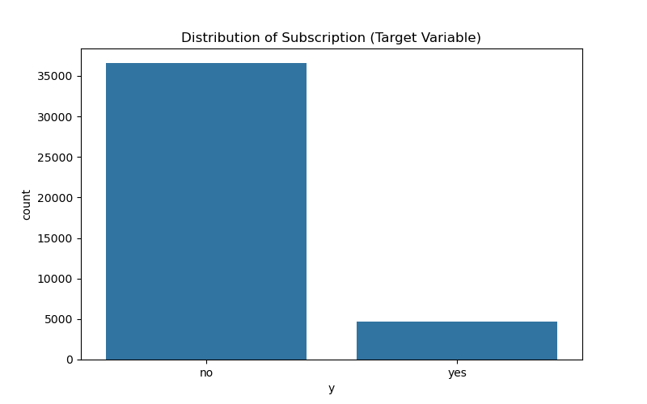
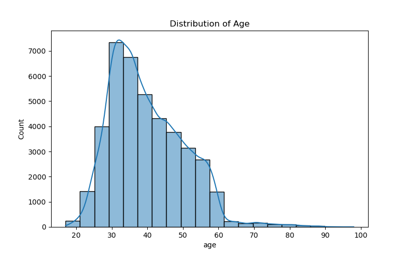
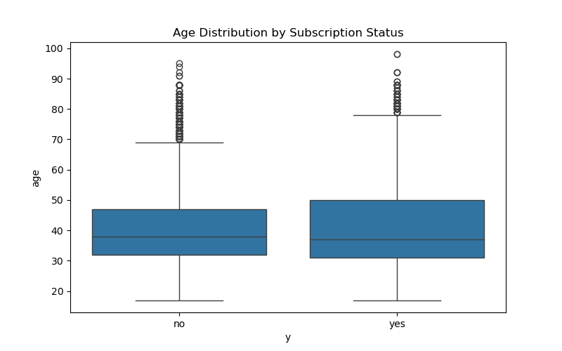
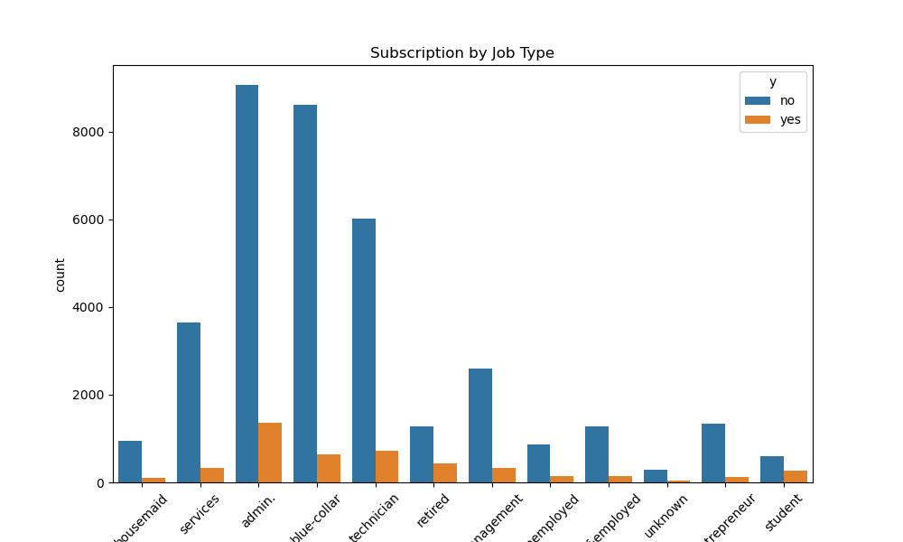
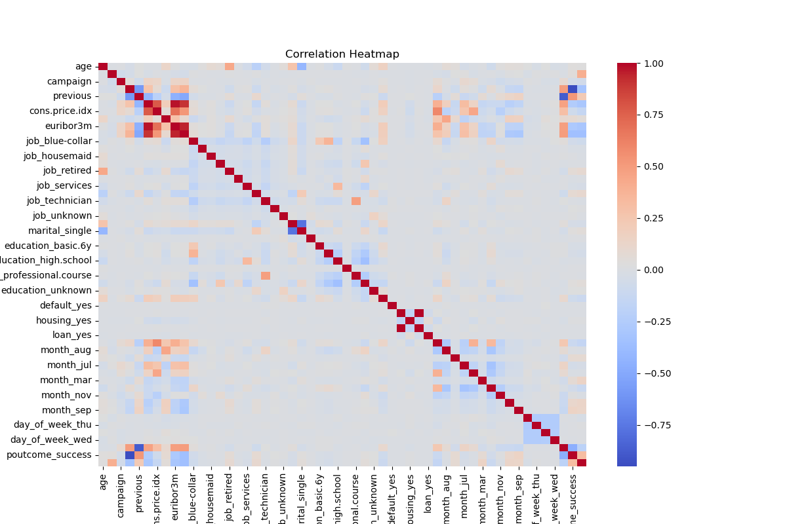
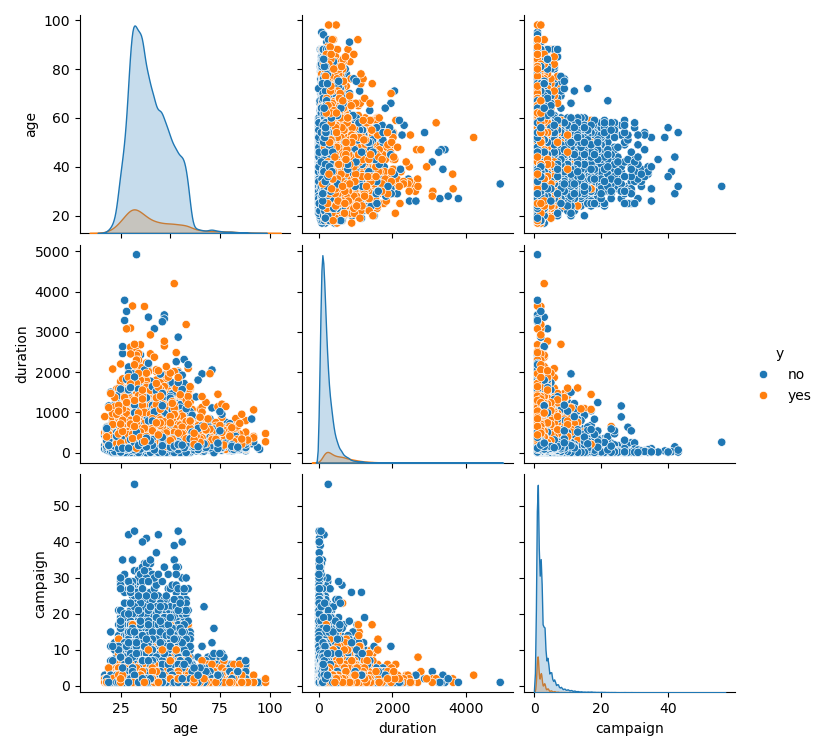
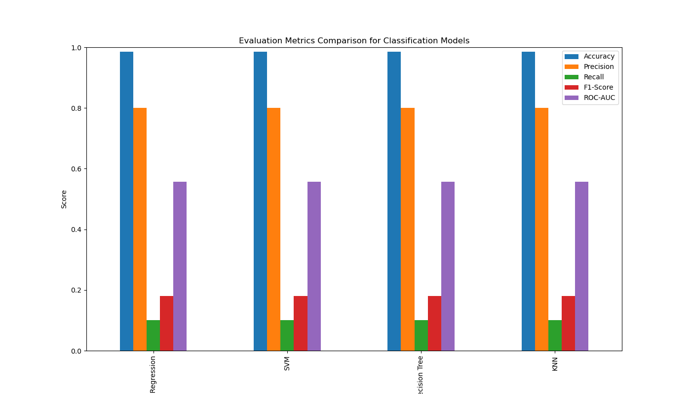

# Berkeley
Berkeley ML/AI Modules and Practical application III: Portuguese Direct Bank Marketing via PhoneCalls

## Practical Application3 Portuguese Direct Bank Marketing via PhoneCalls <What Apply classification methods and Compare>
Compare the results of k-nearest neighbors, logistic regression, decision trees, and support vector machines.

## [Juypter Notebook](https://github.com/Jhonson924/berkeley/blob/main/DirectBankMarketing/BankMarketing.ipynb)

## 1. Business Context
- The data is related with direct marketing campaigns (phone calls) of a Portuguese banking institution. 
- The classification goal is to predict if the client will subscribe a term deposit (variable y).

### 1.2 Business Problem Statement
- The primary goal of this analysis was to predict whether a client would subscribe to a term deposit after a marketing phone call. 
- This predictive model can significantly enhance marketing efficiency and customer targeting, helping banks minimize costs and maximize campaign success.

### 1.2 Business Goal
- The classification goal is to predict if the client will subscribe (yes/no) a term deposit (variable y).

## 2. Data Understanding
**Data Sources:**
   - 4 datasets were analyzed: `bank.csv`, `bank-full.csv`, `bank-additional.csv`, `bank-additional-full.csv`.
   - `bank.csv` and `bank-full.csv` contain 17 features, while `bank-additional.csv` & `bank-additional-full.csv` contains 20 features with richer information.
   - `bank-additional-full`: will be analyzed for classification model including SVM.

**Dataset Description:**
- Source(data-additional-full.csv): The dataset originates from a Portuguese banking institution's direct marketing campaigns involving phone calls.
- Purpose: The primary goal is to predict whether a customer will subscribe to a term deposit (a type of savings account).
- Size: It contains 41,188 examples (rows) and 20 input features (columns).
- Ordering: The data is ordered chronologically, starting from May 2008 to November 2010.
- Target Variable: The target variable is 'y', which indicates whether a client subscribed to a term deposit ('yes' or 'no').

**Key Features:**
- Demographics: Likely features like age, job, marital status, education level.
- Socioeconomic: Features like housing loan, personal loan, employment status.
- Campaign Information: Details about the campaign, like the number of contacts performed during this campaign, duration of the last contact.
- Previous Contact: Information on past contacts with the client, like the number of contacts performed before this campaign.
- Other Factors: Potentially, features like contact communication type, month of the year, day of the week.

**Potential Challenges:**

- Imbalanced Data: It's possible that the number of clients who subscribe to a term deposit is considerably - - lower compared to those who don't. This can affect model performance and may require techniques to address class imbalance.
- Feature Engineering: Some features may need transformation or combination to extract more relevant information for the prediction task.
- Model Selection: Selecting the appropriate machine learning model that can effectively handle the data and produce accurate predictions.

## 3. Exploratory Data Analysis (EDA)
- Visualized the distribution of each feature to understand the data patterns.
- Analyzed correlation matrices to identify relationships between numerical variables.
- Plotted pairplots and scatter plots to detect possible outliers and interactions.
- Derived insights into client profiles that are more likely to subscribe.

### 3.1 Distribution of Target Variable

**Imbalanced Distribution**
- The vast majority of instances are labeled as "no".
- Only a small portion is labeled as "yes".
- This clearly indicates a class imbalance problem, which can significantly impact model performance.

**Count Details:**
- The number of "no" cases is significantly higher (approximately 37,000+).
- The number of "yes" cases is much lower (around 5,000+).

### 3.2 Distribution of Age

- The distribution is right-skewed.
- Most of the data points are concentrated on the left side of the plot.
- The peak of the distribution is around 30 to 40 years.
- This indicates that most clients contacted during the marketing campaign are in their 30s to 40s
- There are fewer clients from the younger (below 20) and older (above 70) age groups.
- The right-skewed distribution indicates that while most clients are younger (30-40), a smaller number of clients are significantly older.

### 3.3 Relationship between Age and Subscription

- Both subscribers (yes) and non-subscribers (no) have a similar median age of around 40 years, indicating that age alone is not a strong predictor of subscription.
- The IQR(Interquartile Range) is comparable for both categories, with most ages falling between 30 and 50 years, representing the majority of the client base.
- There are significant outliers on the higher end (ages above 70), especially in the non-subscriber group, indicating that older clients are less likely to subscribe.
- The distribution is slightly more compact for subscribers compared to non-subscribers, indicating that subscribers tend to be in a more concentrated age range.

### 3.4 Categorical Variable Analysis (jobType)

- The most common job types among the clients are "admin.", "blue-collar", and "technician".
- Retired" and "students" show relatively higher subscription rates compared to other job types.
- Job types like "admin." and "blue-collar" have a significantly higher count of non-subscription (no) compared to subscriptions (yes).
- "housemaid", "unemployed", "self-employed", and "entrepreneur" have notably low subscription rates.
- Certain jobs (like "retired" and "student") may be more inclined to subscribe to term deposits, possibly due to different financial priorities or time availability.

### 3.5 Correlation Heatmap

**Strong Positive Correlation (Dark Red):**
- Some features are highly correlated with themselves (diagonal), which is expected.
- Variables like "emp.var.rate" and "euribor3m" show strong positive correlations, indicating they may capture similar economic trends.

**Strong Negative Correlation (Dark Blue):**
- A significant negative correlation is observed between "euribor3m" and "cons.price.idx".
- This suggests that higher interest rates are associated with lower consumer price indices.

**Weak or No Correlation (Gray/Light Colors):**
- Most of the feature pairs have weak or no significant correlation.
- This is beneficial for models that prefer independent variables, such as Logistic Regression.

### 3.6 Pairplot to visualize relationships between age, duration, and campaign

**Distribution of Each Variable:**
- The diagonal plots show KDE plots (Kernel Density Estimates) for each variable.
- Age: The distribution is skewed towards younger clients (30-40 years).
- Duration: Most call durations are short, with a long tail indicating some lengthy calls.
- Campaign: Most clients were contacted fewer than 10 times, with a few outliers receiving significantly more calls.

**Relationship Between Variables:**

- **Age vs. Duration:**
- Younger clients tend to have shorter call durations.
- There is no clear relationship between age and duration.

- **Duration vs. Campaign:**
- Calls with longer durations often result in successful subscriptions (yes).
- More campaign contacts do not necessarily increase subscription rates.

- **Age vs. Campaign:**
-  There is no clear relationship between age and the number of campaign contacts.

2. **Data Cleaning:**
   - Handled missing values and duplicates.
   - Performed data encoding for categorical variables.
   - Applied log transformation to reduce skewness and minimize the effect of outliers.

3. **Data Transformation:**
   - One-hot encoding was applied to categorical features.
   - Numerical features were scaled using `StandardScaler`.
   - Applied `PCA` to reduce dimensionality while preserving 95% variance.

###  Exploratory Data Analysis (EDA)
1. Visualized the distribution of each feature to understand the data patterns.
2. Analyzed correlation matrices to identify relationships between numerical variables.
3. Plotted pairplots and scatter plots to detect possible outliers and interactions.
4. Derived insights into client profiles that are more likely to subscribe.

### Modeling and Evaluation
1. Built four classification models:
   - **Logistic Regression**
   - **Support Vector Machine (SVM)**
   - **Decision Trees**
   - **K-Nearest Neighbors (KNN)**

2. Applied cross-validation and hyperparameter tuning to optimize each model.
3. Performed threshold optimization to balance precision and recall.
4. Visualized decision boundaries to understand model behavior.

### Evaluation Metrics
Models were evaluated using the following metrics:
- **Accuracy:** Proportion of correctly predicted instances.
- **Precision:** Accuracy of positive predictions.
- **Recall:** Ability to detect actual positives.
- **F1-Score:** Balance between precision and recall.
- **ROC-AUC:** Ability to distinguish between classes.

### Key Findings
1. **Best Performing Models:**
   - **Logistic Regression and SVM** showed the highest accuracy and balanced precision-recall scores.
   - **Decision Trees** performed well but were prone to overfitting.
   - **KNN** struggled due to high-dimensionality.

2. **Threshold Optimization:**
   - Optimal thresholds varied per model but typically ranged between **0.3 and 0.6** for the best trade-off between precision and recall.

3. **Model Performance:**

   - Logistic Regression demonstrated the best generalization with high interpretability.
   - SVM performed similarly but was computationally more expensive.
   - Decision Trees provided interpretability but lacked robustness.
   - KNN was sensitive to feature scaling and dimensionality.

### Recommendations
1. **Model Deployment:**
   - Deploy **Logistic Regression** as the primary model due to its high performance and interpretability.
   - Use **SVM** as a secondary option for more complex decision boundaries.

2. **Marketing Strategy:**
   - Prioritize contacting clients with high predicted subscription probability.
   - Focus on improving data quality and adding features related to customer engagement and feedback.

3. **Future Improvements:**
   - Explore **ensemble methods** like Random Forest or Gradient Boosting for improved accuracy.
   - Implement **model explainability techniques** to increase trust and transparency.
   - Continuously monitor model performance and update as customer behaviors evolve.

### Next Steps
1. **Implementation and Monitoring:**
   - Integrate the model into the marketing workflow for real-time predictions.
   - Monitor model performance periodically to detect drift.

2. **Further Analysis:**
   - Conduct a **feature importance analysis** to identify the most influential factors.
   - Perform **customer segmentation** to identify different profiles for targeted marketing.

---

### Conclusion
The analysis demonstrates that predictive modeling can significantly enhance the efficiency of marketing campaigns by targeting clients more likely to subscribe to term deposits. By implementing the recommended models and strategies, banks can improve campaign success rates while reducing operational costs