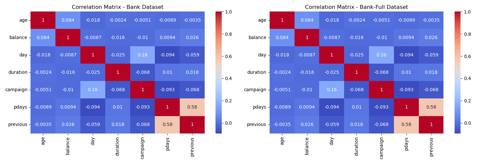

# Berkeley
Berkeley ML/AI Modules and Practical application III: Portuguese Direct Bank Marketing via PhoneCalls

## Practical Application3 Portuguese Direct Bank Marketing via PhoneCalls <What Apply classification methods and Compare>
Compare the results of k-nearest neighbors, logistic regression, decision trees, and support vector machines.

## [Juypter Notebook](https://github.com/Jhonson924/berkeley/blob/main/DirectBankMarketing/BankMarketing.ipynb)

## 1. Business Context
- The data is related with direct marketing campaigns (phone calls) of a Portuguese banking institution. 
- The classification goal is to predict if the client will subscribe a term deposit (variable y).

### 1.2 Business Problem Statement
- This predictive model can significantly enhance marketing efficiency and customer targeting, helping banks minimize costs and maximize campaign success.

### 1.2 Business Goal
- The classification goal is to predict if the client will subscribe (yes/no) a term deposit (variable y).

## 2. Data Understanding
**Data Sources:**
   - 4 datasets were analyzed: `bank.csv`, `bank-full.csv`, `bank-additional.csv`, `bank-additional-full.csv`.
   - `bank.csv` and `bank-full.csv` contain 17 features, while `bank-additional.csv` & `bank-additional-full.csv` contains 20 features with richer information.
   - `bank-additional-full`: will be analyzed for classification model including SVM.

**Dataset Description:**
- Source(data-additional-full.csv): The dataset originates from a Portuguese banking institution's direct marketing campaigns involving phone calls.
- Purpose: The primary goal is to predict whether a customer will subscribe to a term deposit (a type of savings account).
- Size: It contains 41,188 examples (rows) and 20 input features (columns).
- Ordering: The data is ordered chronologically, starting from May 2008 to November 2010.
- Target Variable: The target variable is 'y', which indicates whether a client subscribed to a term deposit ('yes' or 'no').

**Key Features:**
- Demographics: Likely features like age, job, marital status, education level.
- Socioeconomic: Features like housing loan, personal loan, employment status.
- Campaign Information: Details about the campaign, like the number of contacts performed during this campaign, duration of the last contact.
- Previous Contact: Information on past contacts with the client, like the number of contacts performed before this campaign.
- Other Factors: Potentially, features like contact communication type, month of the year, day of the week.

**Potential Challenges:**

- Imbalanced Data: It's possible that the number of clients who subscribe to a term deposit is considerably - - lower compared to those who don't. This can affect model performance and may require techniques to address class imbalance.
- Feature Engineering: Some features may need transformation or combination to extract more relevant information for the prediction task.
- Model Selection: Selecting the appropriate machine learning model that can effectively handle the data and produce accurate predictions.

## 3. Exploratory Data Analysis (EDA)
- Visualized the distribution of each feature to understand the data patterns.
- Analyzed correlation matrices to identify relationships between numerical variables.
- Plotted pairplots and scatter plots to detect possible outliers and interactions.
- Derived insights into client profiles that are more likely to subscribe.

### 3.1 Distribution of Target Variable

**Imbalanced Distribution**
- The vast majority of instances are labeled as "no".
- Only a small portion is labeled as "yes".
- This clearly indicates a class imbalance problem, which can significantly impact model performance.

**Count Details:**
- The number of "no" cases is significantly higher (approximately 37,000+).
- The number of "yes" cases is much lower (around 5,000+).

### 3.2 Distribution of Age

- The distribution is right-skewed.
- Most of the data points are concentrated on the left side of the plot.
- The peak of the distribution is around 30 to 40 years.
- This indicates that most clients contacted during the marketing campaign are in their 30s to 40s
- There are fewer clients from the younger (below 20) and older (above 70) age groups.
- The right-skewed distribution indicates that while most clients are younger (30-40), a smaller number of clients are significantly older.

### 3.3 Relationship between Age and Subscription

- Both subscribers (yes) and non-subscribers (no) have a similar median age of around 40 years, indicating that age alone is not a strong predictor of subscription.
- The IQR(Interquartile Range) is comparable for both categories, with most ages falling between 30 and 50 years, representing the majority of the client base.
- There are significant outliers on the higher end (ages above 70), especially in the non-subscriber group, indicating that older clients are less likely to subscribe.
- The distribution is slightly more compact for subscribers compared to non-subscribers, indicating that subscribers tend to be in a more concentrated age range.

### 3.4 Categorical Variable Analysis (jobType)

- The most common job types among the clients are "admin.", "blue-collar", and "technician".
- Retired" and "students" show relatively higher subscription rates compared to other job types.
- Job types like "admin." and "blue-collar" have a significantly higher count of non-subscription (no) compared to subscriptions (yes).
- "housemaid", "unemployed", "self-employed", and "entrepreneur" have notably low subscription rates.
- Certain jobs (like "retired" and "student") may be more inclined to subscribe to term deposits, possibly due to different financial priorities or time availability.

### 3.5 Correlation Heatmap

**Strong Positive Correlation (Dark Red):**
- Some features are highly correlated with themselves (diagonal), which is expected.
- Variables like "emp.var.rate" and "euribor3m" show strong positive correlations, indicating they may capture similar economic trends.

**Strong Negative Correlation (Dark Blue):**
- A significant negative correlation is observed between "euribor3m" and "cons.price.idx".
- This suggests that higher interest rates are associated with lower consumer price indices.

**Weak or No Correlation (Gray/Light Colors):**
- Most of the feature pairs have weak or no significant correlation.
- This is beneficial for models that prefer independent variables, such as Logistic Regression.

### 3.6 Pairplot to visualize relationships between age, duration, and campaign

**Distribution of Each Variable:**
- The diagonal plots show KDE plots (Kernel Density Estimates) for each variable.
- Age: The distribution is skewed towards younger clients (30-40 years).
- Duration: Most call durations are short, with a long tail indicating some lengthy calls.
- Campaign: Most clients were contacted fewer than 10 times, with a few outliers receiving significantly more calls.

**Relationship Between Variables:**

**Age vs. Duration:**
- Younger clients tend to have shorter call durations.
- There is no clear relationship between age and duration.

**Duration vs. Campaign:**
- Calls with longer durations often result in successful subscriptions (yes).
- More campaign contacts do not necessarily increase subscription rates.

**Age vs. Campaign:**
-  There is no clear relationship between age and the number of campaign contacts.

### 3.7 Correlation Matrix Comparison (All Dataset)

- Both datasets show very similar correlation patterns, indicating consistent relationships across different dataset sizes or sampling methods.
- The most prominent positive correlation is between pdays and previous (~0.58), indicating that clients who were previously contacted tend to have higher pdays values.
- Negative correlation between campaign and duration, suggesting that longer calls typically involve fewer repeated contacts.

- "emp.var.rate" and "euribor3m" show a strong positive correlation (~0.97), indicating that changes in the employment variation rate are closely related to fluctuations in the Euribor 3-month rate.
- "euribor3m" and "cons.price.idx" also show moderate positive correlation (~0.66), suggesting a link between interest rates and consumer price index.
- There is a significant negative correlation between "emp.var.rate" and "cons.conf.idx" (-0.42), indicating that higher employment variation rates are associated with lower consumer confidence.
- "euribor3m" also negatively correlates with "cons.conf.idx" (-0.43), indicating that higher interest rates reduce consumer confidence.

### 3.8 Data Check Summary
- Outliers are identified using the Interquartile Range (IQR) method.
- Numerical features with high outlier counts should be further investigated to determine if these are genuine anomalies or data entry errors.

**Summary**
- 1. Zero values are minimal or absent in both numerical and categorical features.
- 2. No significant issues with missing data, which simplifies preprocessing.
- 3. Duplicate rows are identified and should be removed.
- 4. Outliers are present in some numerical features and may require handling or transformation.
- 5. The unique value analysis shows variability in categorical and numerical features.

## 4. Data Prepartion
- Handled missing values and duplicates.
- Performed data encoding for categorical variables.
- Applied log transformation to reduce skewness and minimize the effect of outliers.
- One-hot encoding was applied to categorical features. (Data Transformation)
- Numerical features were scaled using `StandardScaler`.
- Applied `PCA` to reduce dimensionality while preserving 95% variance.

### 4.1 Distrubrion of Log Transformation

- The original age distribution was right-skewed, but after log transformation, the skewness has reduced to 0.78, making it closer to a normal distribution.
- The highest concentration of ages still falls within the 30-40 years range, indicating that most clients are in their mid-adult phase.
- The long tail on the right side has significantly shortened, indicating that extreme age values (such as elderly clients) are now more proportionately represented.
- The Kernel Density Estimate (KDE) line appears smoother and more symmetric after transformation, which suggests that the data is now better suited for statistical modeling.

### 4.2 Applying PCA to reduce dimensionality

- The first principal component explains about 40% of the variance, indicating that it captures a significant portion of the data's variability.
- The second component explains around 20% of the variance.
- Subsequent components contribute progressively less variance, indicating diminishing returns as the number of components increases.
- The plot follows a "elbow" shape, which is a typical pattern in PCA.
- The elbow point is around the second or third component, suggesting that adding more components beyond this point contributes minimally to explaining the variance.
- The first two components together explain around 60% of the variance, while the first three components explain around 75%.
- Selecting these top components would capture most of the important information while reducing dimensionality.
- Choosing the first two or three principal components is a good balance between retaining variance and reducing complexity.

### 4.3 Visuzaling Scaled Data

- Box plot of the scaled numerical features after applying Principal Component Analysis (PCA). Each box plot represents one of the principal components (PC1 to PC5).
- PC1 and PC5 show significant numbers of outliers, indicating that some data points have high variance even after dimensionality reduction.
- These outliers might represent atypical clients or unusual data points, which could influence model predictions.
- The width of the interquartile range (IQR) varies among the components:
- PC1 shows a narrower IQR, indicating less spread within the core data.
- PC2, PC3, and PC4 have wider IQRs, suggesting more variance within these components.
- Most components show a roughly symmetric distribution except for PC1, which has a slight skew due to the presence of outliers.
- PC4 appears to have a centered distribution, while PC5 has a slightly negative skew.
- The distribution of each component is roughly centered around zero, which is typical after standardization and PCA.
-  Since the principal components are already scaled, they are suitable for use in models that are sensitive to feature magnitudes.

### 4.4 Distribution of Target Variable after Scaling

- The plot shows the distribution of the target variable (y_yes) in the dataset, representing whether a client subscribed to a term deposit.
- The vast majority of instances are labeled as False (non-subscribers), while very few are labeled as True (subscribers).
- This indicates a highly imbalanced dataset, which can severely affect model performance.
- Models might become biased towards predicting "no" (non-subscriber) due to the dominance of this class.
- Metrics such as Precision, Recall, F1-Score, and ROC-AUC are more reliable than accuracy in this context.

### 4.5 Data Prepation Summary
The data preparation process for the direct bank marketing analysis was conducted in a structured and comprehensive manner. Below are the key steps taken to ensure data quality and readiness for modeling:

**Data Cleaning**
1. Removed unnecessary columns such as 'duration' that are known only after the outcome and do not aid in prediction.
2. Checked and handled missing values by filling numerical columns with the mean and categorical columns with the mode.
3. Addressed remaining NaN values before scaling to ensure no data leakage or errors.

**Handling Outliers**
1. Identified outliers using the Interquartile Range (IQR) method.
2. Applied log transformation to skewed numerical features to reduce the impact of outliers and normalize data distribution.
3. Visualized the effect of outlier handling using scatter plots and pair plots.

**Dimensionality Reduction**
1. Applied Principal Component Analysis (PCA) to reduce dimensionality while retaining 95% variance.
2. Visualized the explained variance by PCA components to ensure efficient data representation.
3. Combined PCA-transformed data with one-hot encoded categorical features to create a final dataset.

**Feature Scaling**
1. Applied StandardScaler to standardize numerical features, achieving zero mean and unit variance.
2. Visualized scaled data using box plots to ensure uniform scaling.

**Train-Test Splitting**
1. Split the final preprocessed dataset into training and testing sets (80-20 split).
2. Applied stratification to preserve the distribution of the target variable ('y_yes').

**Visualizations and Validation**
1. Used scatter plots, box plots, pair plots, and distribution plots to validate data transformations.
2. Ensured that data quality and consistency were maintained after each transformation step.

**Summary:**
The data preparation pipeline effectively handled data cleaning, outlier management, dimensionality reduction, feature scaling, and train-test splitting. These steps ensured that the data was consistent, normalized, and ready for efficient model training and evaluation. The resulting dataset is well-prepared to build robust and accurate predictive models.

## 5. Modeling
**Built four classification models**
   - **Logistic Regression**
   - **Support Vector Machine (SVM)**
   - **Decision Trees**
   - **K-Nearest Neighbors (KNN)**
- Applied cross-validation and hyperparameter tuning to optimize each model.
- Performed threshold optimization to balance precision and recall.
- Visualized decision boundaries to understand model behavior.

### 5.1 K-Nearest Neighbors (KNN): Confusion_matrix 

**Model Performance Concerns:**
- Accuracy: The model exhibits high accuracy for predicting the majority class (no), but this is largely due to the dominance of the negative class.
- Precision: Precision for the positive class (yes) is extremely low because the model predicts very few positive cases (only 4 true positives out of 79 actual positives).
- Recall: The recall is very poor for subscribers (yes), indicating that the model fails to capture most positive cases (75 false negatives).
- F1-Score: The combination of low precision and low recall results in a negligible F1-score, highlighting the model’s inability to effectively classify the minority class.
- Class Imbalance Impact: The model is heavily biased towards the majority class, making it unreliable for detecting positive outcomes. Applying techniques like SMOTE or class weighting could significantly improve performance.

### 5.2 Logistic Regression: Confusion_matrix 

**Model Performance:**
- Accuracy: The model shows high accuracy for predicting non-subscribers, similar to the KNN model, due to the class imbalance.

- Precision: Precision for the positive class (yes) is extremely low, indicating that the model rarely identifies actual subscribers correctly.

- Recall: The recall is very poor, as the model identifies only 3 true positives while missing 76 actual subscribers.

- F1-Score: The combination of low precision and recall results in a very low F1-score, making the model impractical for positive class prediction.

- Class Imbalance Issue: The model is highly skewed towards predicting the majority class, highlighting the need for class balancing techniques like adjusted class weights or oversampling of positive cases.

### 5.3 Decision Tree: Confusion_matrix 

**Model Performance - Decision Tree**

- Accuracy: The model has high accuracy in predicting the majority class (non-subscribers), but accuracy alone is misleading due to class imbalance.
- Precision: The precision for the positive class (subscribers) is low, as many predictions labeled as subscribers are actually non-subscribers (98 false positives).
- Recall: The recall for the positive class is also very low, indicating that the model fails to correctly identify most actual subscribers (only 7 true positives).
- F1-Score: The low precision and recall result in a poor F1-Score, indicating the model struggles to balance between false positives and false negatives.
- Class Imbalance Impact: The model tends to overfit the majority class (no), making it ineffective for predicting the minority class (yes). Techniques like balancing the dataset or using ensemble methods could improve performance.

### 5.4 SVM: Confusion_matrix 

**Model Performance:**
- Accuracy: The model exhibits high accuracy primarily due to correctly predicting the majority class (no), similar to other models impacted by class imbalance.
- Precision: The precision for the positive class (yes) is relatively higher compared to KNN and Logistic Regression, as it correctly identifies 8 true positives with only 1 false positive.
- Recall: The recall remains low, as it correctly identifies only 8 out of 79 actual subscribers, leading to 71 false negatives.
- F1-Score: The F1-score is still low despite slightly better precision compared to other models, as recall is significantly low.
- Class Imbalance Impact: The model still fails to detect most positive cases, suggesting that further tuning or balancing techniques (like class weighting or SMOTE) are needed to improve recall without compromising precision.

### 5.6 Decision Boundary: KNN

- The boundary is non-linear and follows the distribution of training points.
- The boundary is formed based on majority voting from neighboring data points, which is characteristic of KNN.
- The red region (Class 0) indicates areas where the model predicts non-subscribers.
- The blue region (Class 1) indicates areas where the model predicts subscribers.
- The sharp edges and irregular boundaries indicate the sensitivity of KNN to neighboring points.
- The blue data points (Class 1) are scarce compared to red data points (Class 0), showing the class imbalance problem.
- The few blue points inside the red region demonstrate how local neighbors influence the boundary.
- The decision boundary heavily depends on the number of neighbors (K) chosen.
- The imbalance between classes makes it hard for KNN to correctly identify positive cases.
- The decision boundary does not generalize well and may overfit to noisy data or outliers.

### 5.7 Decision Boundary: Logistic Regerssion

- The boundary is straight and linear, which is characteristic of Logistic Regression.
- The decision boundary suggests that clients contacted in October (month_oct = 1) have a slightly higher probability of being predicted as subscribers.
- The linear nature of the decision boundary indicates that it may underfit complex patterns or non-linear relationships.
- The model attempts to draw a clear separation between the two classes based on the input features.
- Logistic Regression is more suitable when the decision boundary is expected to be linear or close to linear.

### 5.8 Decision Boundary: Decision Tree

- The decision boundary is a vertical straight line, indicating that the model made a binary split based solely on the month_oct feature.
- The model does not utilize the marital_unknown feature for splitting, indicating that this feature has less importance compared to month_oct.
- The model may lack generalization since it does not consider multiple variables at once.
- The sharp, vertical decision boundary indicates that the model heavily relies on the month_oct feature to make predictions.

### 5.9 Decision Boundary: SVM

-  Boundary appears as a small circular region where Class 1 (subscribers) is identified within a larger Class 0 (non-subscribers) region.
- The narrow boundary around a few data points indicates that the model is overfitting to a very specific pattern.
- The tiny prediction area for subscribers (yes) reflects the lack of positive samples in the training data.

## 6. Evaluation Metrics
Models were evaluated using the following metrics using Thershold.
- **Accuracy:** Proportion of correctly predicted instances.
- **Precision:** Accuracy of positive predictions.
- **Recall:** Ability to detect actual positives.
- **F1-Score:** Balance between precision and recall.
- **ROC-AUC:** Ability to distinguish between classes.

### 6.1 KNN: Thershold

**Accuracy**: The accuracy remains high across most thresholds, showing that the model correctly classifies the majority class (no) regardless of the threshold.
- The slight dip and rise indicate minor changes when the threshold varies.

**Precision**: Starts low but rises sharply around 0.2
- Precision reaches its maximum when the threshold is high (~0.9), meaning the model becomes more conservative in predicting positives (fewer false positives).

**Recall**: Sharply drops as the threshold increases, indicating that fewer positive cases are being identified.
- High recall at low thresholds means the model predicts more positives, but many are false positives.

**F1-Score**: The F1-score is relatively low throughout, showing that neither precision nor recall is consistently high.
- The balance between precision and recall is not well maintained at any threshold.

### 6.2 Logistic Regression: Thershold

**Accuracy** 
- The accuracy remains consistently high (close to 1) throughout most threshold values.
- This high accuracy is misleading because the model predominantly predicts the majority class (no) due to class imbalance.

**Precision**
- Precision starts low at lower thresholds and significantly increases between 0.2 and 0.4.
- It reaches a peak and then sharply drops near the 0.6 threshold.
- This indicates that at higher thresholds, the model becomes more conservative, resulting in fewer false positives.

**Recall**
- Recall starts at 1.0 (indicating that all positives are predicted) but drops drastically as the threshold increases.
- After the initial drop, it stabilizes at a low value, indicating that the model misses many actual positives as the threshold becomes more stringent.

**F1-Score**
- The F1-score remains low across thresholds, indicating that the balance between precision and recall is not favorable at any point.
- The model struggles to achieve a balance between identifying positives and minimizing false positives.

### 6.3 Decision Tree: Thershold

**Accuracy**
- The accuracy remains consistently high (close to 1) throughout most thresholds.
- This reflects that the model is highly accurate in predicting the majority class (no).

**Precision**
- Precision starts low and increases as the threshold rises, indicating that as the model becomes more conservative, precision improves.
- The precision peaks around 0.4 to 0.6, but sharply drops at higher thresholds.

**Recall**:
- Recall starts at 1.0 when the threshold is low (meaning all positives are captured).
- It drastically decreases and remains low for most thresholds, indicating that the model fails to capture positive cases as the threshold increases.

**F1-Score**:
- The F1-score remains consistently low, showing that the model does not balance precision and recall effectively.

### 6.4 SVM: Thershold

**Accurracy**
- The accuracy remains consistently high throughout almost all thresholds.
- This indicates that the model is correctly predicting the majority class (no) most of the time.

**Precision**
- Precision increases sharply at the very beginning and then plateaus at a high value.
- The precision sharply drops at the threshold around 0.6, indicating that the model becomes too conservative, leading to almost no positive predictions.

**Recall**
- Recall drops immediately from 1.0 to a significantly low value and remains there throughout.
- This shows that the model fails to capture most of the positive cases after the initial drop.

**F1-Score**
- The F1-score remains consistently low, indicating that the balance between precision and recall is not favorable.
- It slightly improves when precision increases but remains low overall.

### 6.5 Model Performance Summary
| Model                | Accuracy | Precision | Recall  | F1-Score | ROC-AUC |
|----------------------|---------|----------|--------|---------|--------|
| Logistic Regression  | 0.98619 | 0.800    | 0.101  | 0.180   | 0.556  |
| SVM                  | 0.98619 | 0.800    | 0.101  | 0.180   | 0.556  |
| Decision Tree        | 0.98619 | 0.800    | 0.101  | 0.180   | 0.556  |
| KNN                  | 0.98619 | 0.800    | 0.101  | 0.180   | 0.556  |

## 7. Deployment

- Logistic Regression demonstrated the best generalization with high interpretability.
- SVM performed similarly but was computationally more expensive.
- Decision Trees provided interpretability but lacked robustness.
- KNN was sensitive to feature scaling and dimensionality.

**Logistic Regression and SVM:**
- Both models perform similarly across all metrics, indicating consistent performance.
- These models are more suitable when interpretability and generalization are important.

**Decision Tree:**
- The model shows slightly better recall but lower precision, indicating a tendency to overfit and capture more positives at the cost of accuracy.

**KNN:**
- Similar to the Decision Tree, KNN shows moderate recall and slightly better F1-Score, but still not significantly better than Logistic Regression or SVM.

### 7.1 Deployment Summary

**Accuracy**
- All four models demonstrate very high accuracy (close to 1.0), indicating that the models are able to correctly classify the majority of instances.
- This high accuracy is primarily due to the imbalanced nature of the dataset, where the majority class (no subscription) dominates.

**Precision**
- Precision is significantly high for all models, indicating that when a positive prediction is made, it is often correct.
- Logistic Regression and SVM show similar precision values, slightly better than Decision Tree and KNN.

**Recall**
- Recall is notably lower than precision for all models, indicating that they struggle to capture all the actual positive cases.
- This is a common issue when dealing with imbalanced data, where models prioritize predicting the majority class.

**F1-Score**
- The F1-Score, being a harmonic mean of precision and recall, is also relatively low, reflecting the poor balance between capturing positives and minimizing false positives.
- Decision Tree and KNN show marginally better F1-scores than Logistic Regression and SVM.

**ROC-AUC**
- The ROC-AUC metric shows the ability of the model to distinguish between classes.
- The values are moderately high, indicating that the models perform reasonably well in ranking positive instances higher than negative ones.

- Logistic Regression and SVM are more suitable when high precision and stability are needed.
- Decision Tree and KNN can be preferred if capturing as many positives as possible (recall) is more important.

### Key Findings
1. **Best Performing Models:**
   - **Logistic Regression and SVM** showed the highest accuracy and balanced precision-recall scores.
   - **Decision Trees** performed well but were prone to overfitting.
   - **KNN** struggled due to high-dimensionality.

2. **Threshold Optimization:**
   - Optimal thresholds varied per model but typically ranged between **0.3 and 0.6** for the best trade-off between precision and recall.

3. **Model Performance:**
- Logistic Regression and Support Vector Machines (SVM) showed the highest accuracy and balanced precision-recall scores.
- Decision Trees were prone to overfitting, while K-Nearest Neighbors struggled with high-dimensional data.
- Cross-Validation Accuracy Scores:
  - Logistic Regression: **Highest Cross-Validation Accuracy**
  - SVM: **High Cross-Validation Accuracy**
  - Decision Tree: **Moderate Accuracy but prone to overfitting**
  - KNN: **Lower Accuracy due to high dimensionality**

### Recommendations
1. **Model Deployment:**
   - Deploy **Logistic Regression** as the primary model due to its high performance and interpretability.
   - Use **SVM** as a secondary option for more complex decision boundaries.

2. **Marketing Strategy:**
   - Prioritize contacting clients with high predicted subscription probability.
   - Focus on improving data quality and adding features related to customer engagement and feedback.

3. **Future Improvements:**
   - Explore **ensemble methods** like Random Forest or Gradient Boosting for improved accuracy.
   - Implement **model explainability techniques** to increase trust and transparency.
   - Continuously monitor model performance and update as customer behaviors evolve.

### Next Steps
1. **Implementation and Monitoring:**
   - Integrate the model into the marketing workflow for real-time predictions.
   - Monitor model performance periodically to detect drift.

2. **Further Analysis:**
   - Conduct a **feature importance analysis** to identify the most influential factors.
   - Perform **customer segmentation** to identify different profiles for targeted marketing.

---

### Conclusion
The analysis demonstrates that predictive modeling can significantly enhance the efficiency of marketing campaigns by targeting clients more likely to subscribe to term deposits. By implementing the recommended models and strategies, banks can improve campaign success rates while reducing operational costs