# Berkeley: Capstone Project: 

## Fraud Detection ML/AI Model in Financial Transactions 

## [Juypter Notebook](https://github.com/Jhonson924/berkeley/blob/main/FinancialTransaction_FraudDetectionModel/financialTransactionFraudDetection.ipynb)

## [Deployment model Files (pkl)](https://github.com/Jhonson924/berkeley/tree/main/FinancialTransaction_FraudDetectionModel/model%20pkl)

# 1. Business Understanding

## 1.1. Overview
This comprehensive financial dataset combines transaction records, customer information, and card data from a banking institution, spanning across the 2010s decade.

## 1.2. Dataset

[💳 Financial Transactions Dataset: Analytics](https://www.kaggle.com/datasets/computingvictor/transactions-fraud-datasets)

Links to an external site.

5 datasets will be analyzed: Primarly for Fraud analysis and detection model

- transactions_data.csv: Main transaction records
- cards_data.csv: Credit/debit card details
- users_data.csv: User/customer demographic data
- mcc_codes.json: Merchant category classification
- train_fraud_labels.json:
    
-- Binary fraud labels for transactions (target),
-- Indicates fraudulent vs. legitimate transactions
-- Ideal for training supervised fraud detection models

Each dataset contributes to building a holistic feature set for fraud detection.

## 1.3. Business Context

The primary objective of this dataset is to facilitate the development and evaluation of machine learning models aimed at detecting fraudulent financial transactions

The goal of this project is to predict whether a given financial transaction is fraudulent or not, based on historical transaction data provided in the dataset.

    In financial systems, fraud detection is critical to prevent monetary loss, protect customers, and maintain trust in payment platforms.

    Early and accurate detection of fraud reduces financial risks and operational costs for banks, fintech companies, and e-commerce platforms.

    Build a binary classification model that, given a new transaction’s features (such as amount, timestamp, transaction type, etc.), predicts the likelihood that it is fraudulent(Fraud or Not Fraud)

## 1.4. Business Goal

- Fraud Detection and Security
- Create risk scoring models

# 2. Data Understanding

## 2.1 Dataset understanding: cards_data
- card_number and id are unique identifiers.

- card_brand and card_type are categorical features with a few distinct values.

- credit_limit is stored as a string (e.g., $24295) and will need conversion for numeric analysis.

- card_on_dark_web has only one value (No) — likely not useful for predictive modeling unless there's variation elsewhere.

- Columns like expires, acct_open_date, and year_pin_last_changed are time-based features that can be transformed further.

## 2.2 Dataset understanding: mcc_codes
- The MCC (Merchant Category Code) mapping examples like:

    5812: Eating Places and Restaurants

    5541: Service Stations

    7996: Amusement Parks, Carnivals, Circuses

- This mapping can be used to enrich transaction data by decoding MCC codes into readable categories.

## 2.3 Dataset understanding: users_data
- Rows and Columns: The dataset contains 2,000 records and 14 columns.

- No Missing Values across any columns.

- Gender Distribution:

        Female: 1,016 users

        Male: 984 users (nearly balanced)

- Uniqueness:

        id is unique per user.

        address is nearly unique (1999 unique values out of 2000).

- Age:

        current_age ranges from 18 to 97 (80 unique values).

        retirement_age shows planning across a wide range (29 unique values).

- Financial Fields:

        per_capita_income, yearly_income, and total_debt contain a high degree of variance and should be analyzed further (converted to numeric).

- Credit Information:

        credit_score spans 321 distinct values – good for regression or segmentation.

        num_credit_cards varies from 0 to 8, indicating different credit utilization behaviors.

## 2.4 Dataset understanding: Transactions Data
Dataset contains transaction-level information with the following columns:

- id: Transaction ID
- date: Timestamp of the transaction
- client_id, card_id: Identifiers for the user and card
- amount: Transaction amount (some with parentheses indicating negative values)
- use_chip: Method of card use (e.g., swipe)
- merchant_id, merchant_city, merchant_state, zip, mcc: Merchant details
- errors: Possibly fraud or error indicators

**Observation1:**
- Detailed transaction records including amounts, timestamps, and merchant details
- Covers transactions throughout the 2010s
- Features transaction types, amounts, and merchant information
- Perfect for analyzing spending patterns and building fraud detection models

## 2.5 Dataset understanding: train_fraud_labels
**Fraud Labels Observations**
- Binary classification labels for transactions
- Indicates fraudulent vs. legitimate transactions
- Ideal for training supervised fraud detection models
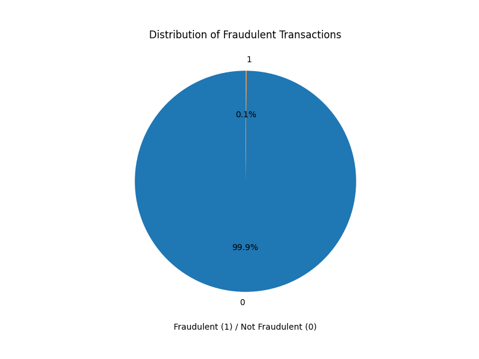
- This dataset is heavily imbalanced, which is common in fraud detection scenarios.

- Such imbalance means that if a model simply predicts "Not Fraudulent" for every transaction, it would still achieve very high accuracy (~99.9%) — but would fail at detecting frauds, which are the critical minority.

## 2.6 Data Understanding Summary
*   Only Transaction Data, Card Data and User Data will be used and merged for ML/AI modeling Techniques.
*   MCC_Codes data will be used for reference if required.

# 3. Exploratory Data Analysis (EDA)

## 3.1. Data Exploration: using - cards_data
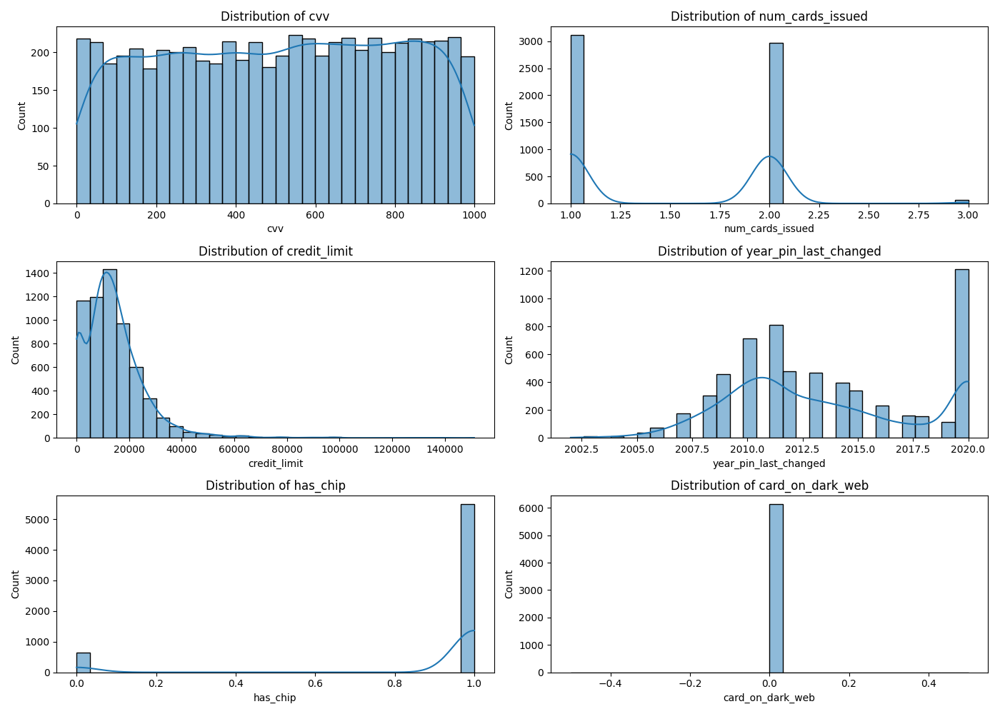
- cvv: Uniformly distributed (likely due to random generation or truncation).

- num_cards_issued: Mostly 1 or 2 cards, few outliers.

- credit_limit: Right-skewed distribution; most clients have lower credit limits.

- year_pin_last_changed: Clusters around early 2000s to 2020.

- has_chip: Binary distribution — mostly "YES" (1).

- card_on_dark_web: Almost all values are 0 — very few cards reported on the dark web.

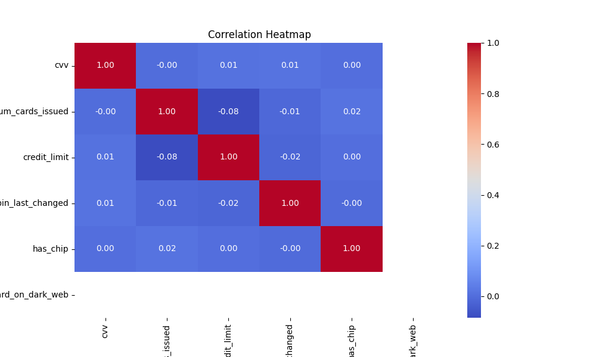
- has_chip and card_on_dark_web show a slight negative correlation.

- credit_limit has low correlation with other features.

- num_cards_issued shows weak positive correlation with has_chip.

## 3.2. Data Exploration: using - users_data
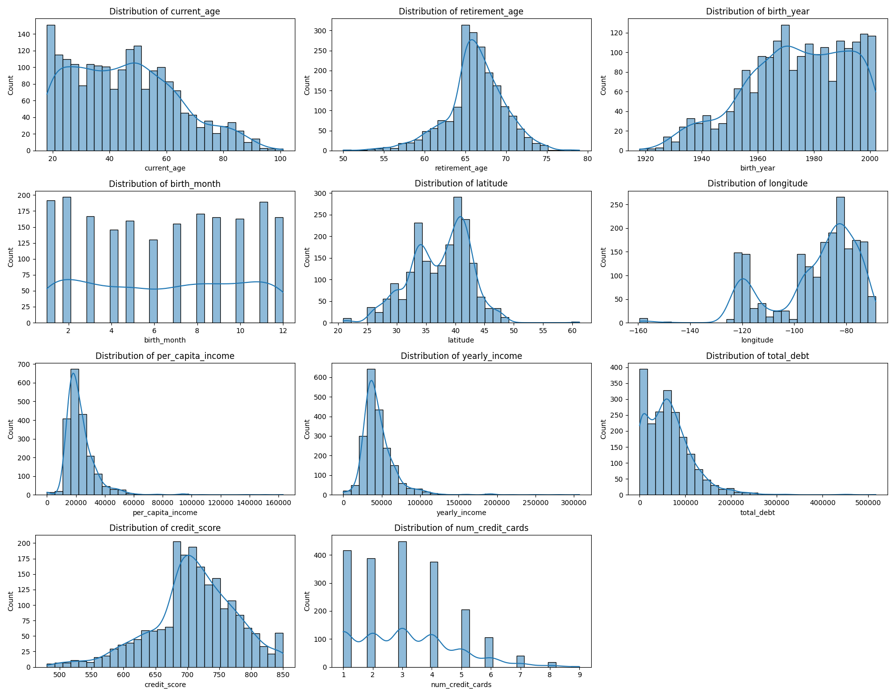
- Age Distribution: Most users are aged 40–70; typical retirement ages range from 60–70.

- Birth Month: Fairly uniform across months.

- Credit Score: Generally well-distributed, centered around 700–750.

- Per Capita & Yearly Income: Right-skewed (majority earn less, few very high).

- Total Debt: Right-skewed; some users carry significant debt.

- Number of Credit Cards: Peaks around 4–5
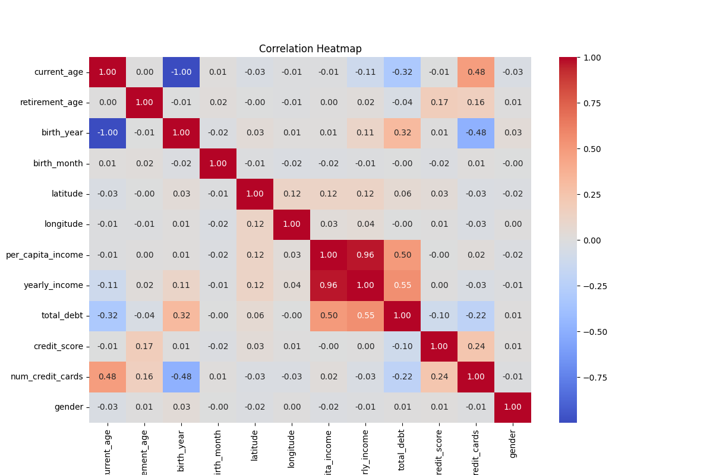
**Strong positive correlation between:**

- yearly_income and per_capita_income

**Weak correlation between:**

- credit_score and debt/income levels

- num_credit_cards and credit score
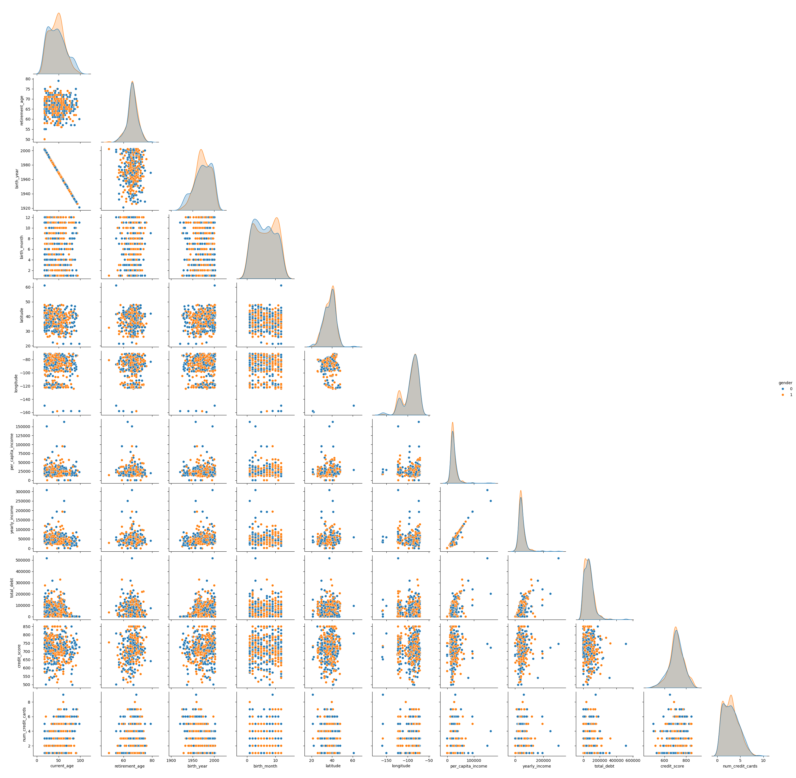
- Gender-based clusters are not strongly separated in most numeric features.

- Outliers are visible in income and debt values.

- Latitude/Longitude pairs show varied user geographies.

## 3.3. Data Exploration: using - transactions_data
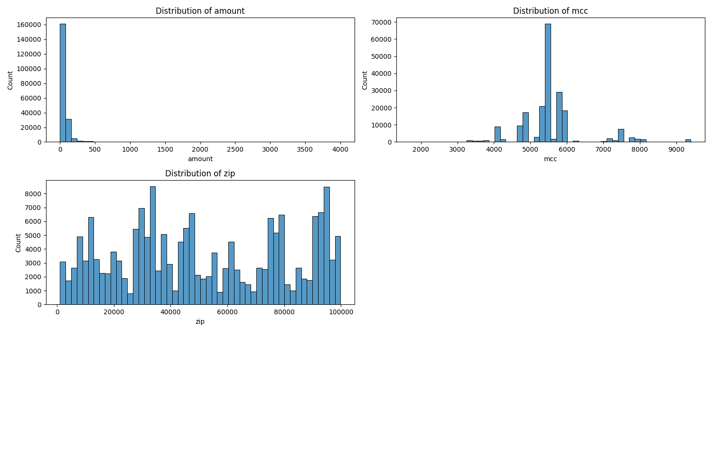
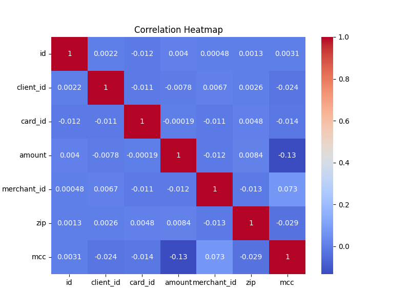

**Transaction Data Observation2:**
| Feature Pair          | Correlation | Observation                                                                               |
| --------------------- | ----------- | ----------------------------------------------------------------------------------------- |
| `mcc` & `merchant_id` | **0.077**   | Highest correlation in the matrix, though still weak. Possibly similar merchant types.    |
| `amount` & `hour`     | **0.054**   | Slight tendency for amount to vary with hour—could relate to spending patterns.           |
| `mcc` & `amount`      | **−0.034**  | Minor negative correlation—some merchant categories may have lower/higher average spends. |
| `mcc` & `hour`        | **0.031**   | Possibly some merchant categories operate more at specific times.                         |
| `zip` & `card_id`     | **0.017**   | Very weak correlation; some spatial relevance to card issuance or usage.                  |

**No Strong Correlations:**

- All values are close to 0, indicating little to no linear relationship between variables.

**Feature Independence:**

- Variables such as amount, mcc, hour, and merchant_id are largely independent, which may provide diverse signals in predictive modeling.

# 4. Distribution of Amount
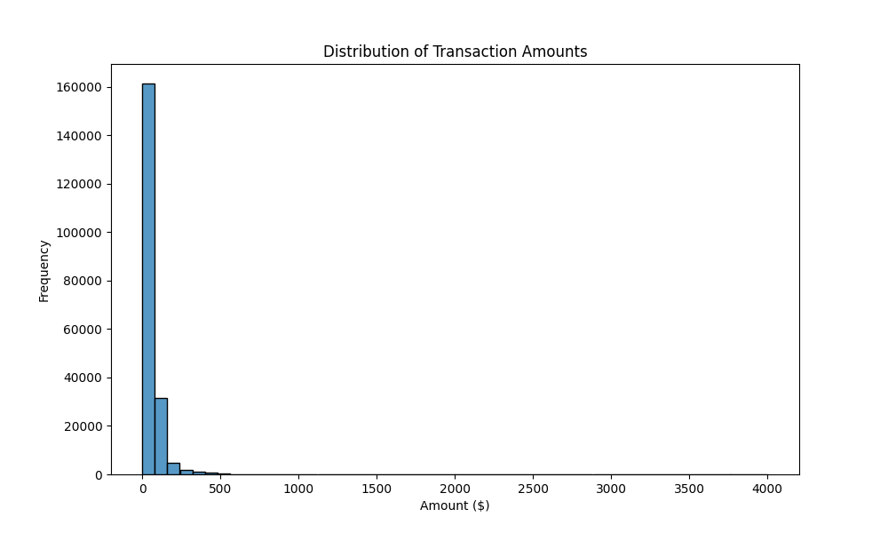
**Observations:**
Highly Skewed Distribution:

- The distribution is heavily right-skewed (positively skewed), meaning most transactions have relatively small amounts.

- A large majority of transaction amounts are concentrated near $0, forming a tall, narrow spike.

**Long Tail:**

- There's a long tail stretching toward the right, going up to amounts around $7000, but very few transactions fall in that range.

**Outliers Present:**

- The sparse bars far to the right suggest the presence of outliers or high-value transactions.

**Data Imbalance:**

- The massive spike near 0 and the flatness elsewhere indicate that most of your transactions are of small monetary value, which can pose a challenge for fraud detection models if high-value fraud is rare.

## 4.1 Distribution transaction hour
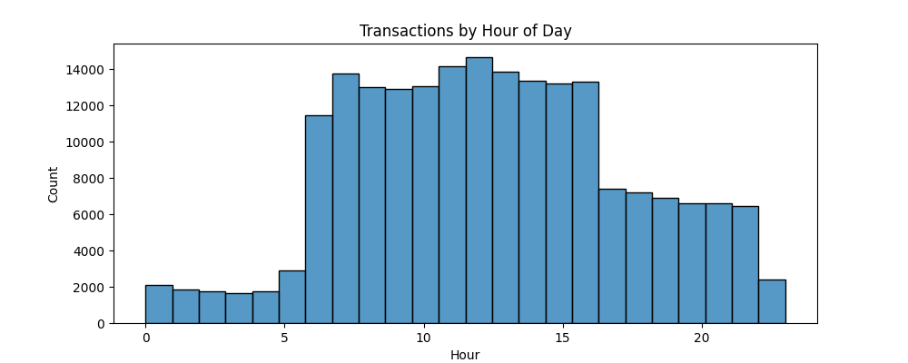
- Peak transaction hours: Transactions sharply increase starting from 6 AM and peak between 10 AM to 1 PM, with each of these hours handling close to or just above 1 million transactions.

- Low activity hours: From 12 AM to 5 AM, transaction volume remains significantly low, likely due to overnight inactivity.

- Gradual decline: After the 1 PM peak, transaction volume gradually decreases, with a noticeable drop after 4 PM.

- Late-night lows: The lowest activity is again observed post-9 PM through midnight.

- This pattern is consistent with consumer behavior and business hours—most financial activities occur during regular daytime hours when businesses are open and customers are active.

- Early morning and late evening dips suggest limited 24/7 activity in the dataset.

## 4.2 Log Transformation
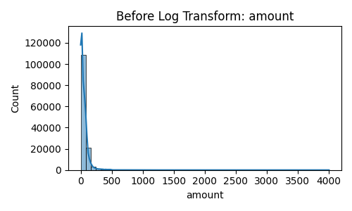
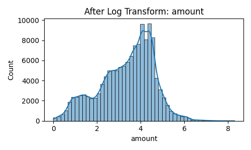

**Before log tranformation**
- The original distribution of amount is right-skewed (positively skewed).

- A large number of transactions have low amounts (clustered near 0), while a few have extremely high values, creating a long tail.

- skewed distribution can negatively impact machine learning models, especially those sensitive to feature scale (e.g., logistic regression, KNN, SVM).

**After log transformation**
- The log transformation compresses the large values and stretches the small ones, converting the skewed distribution into a more normal (bell-shaped) distribution.

- makes the data more suitable for modeling, particularly for algorithms that assume normality or benefit from standardized scales.

## 4.3 PCA Variance plot
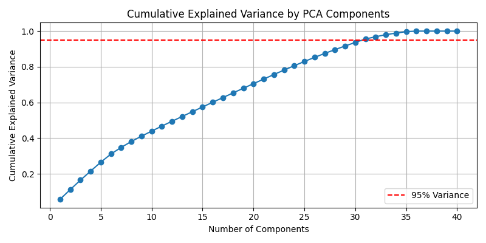
- The curve rises steeply at first, then begins to level off, showing diminishing returns as you add more components.

- Around 30 components, the curve crosses the 0.95 threshold.

- 95% of the original data's variability using just the first ~30 components.

## 4.4 PCA Before Clustering
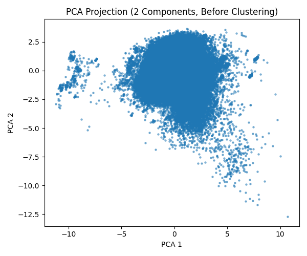
- three to four dense clusters or groupings emerging in this space.

- These indicate natural groupings in the data — excellent for applying unsupervised learning algorithms like KMeans, DBSCAN, or hierarchical clustering.

## 4.5 K-means Clustering
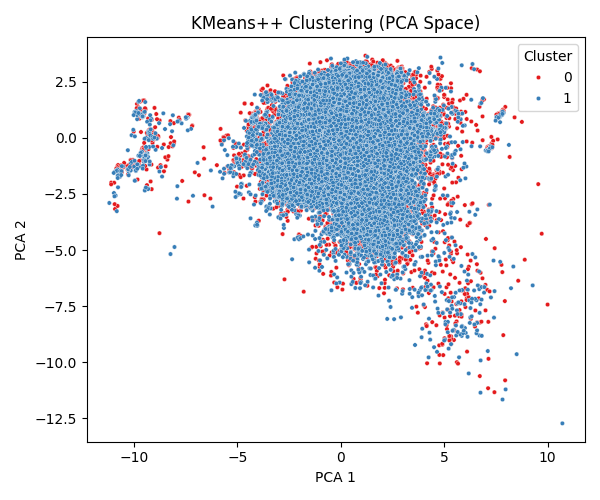
- Most data points belong to Cluster 1 (blue), with a smaller number in Cluster 0 (red).

- Some dense visual clusters are being treated as part of the same KMeans group

- indicating KMeans is not fully capturing the complexity of the structure.

## 4.6 Convert PCA data to df for visualization
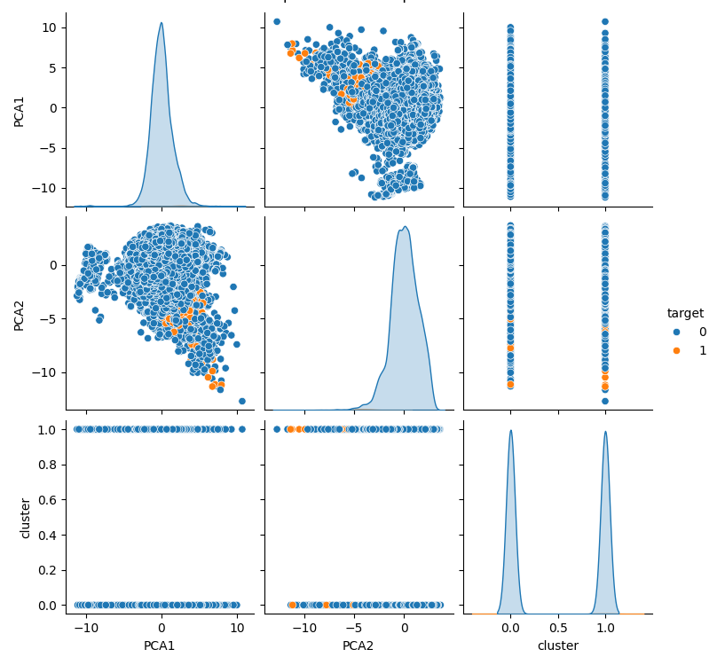
- Clustering shows some ability to separate observations relevant to the target class.

- PCA dimensions preserve structure well, making it easier to visualize patterns and groupings.

- There's a partial alignment between clusters and target, which is promising for semi-supervised or fraud-detection tasks.
# 10. Key Findings

- The dataset is highly imbalanced with very few fraudulent transactions.

- Tree-based ensemble models (XGBoost, Random Forest) outperform simpler models (Logistic Regression, Decision Tree) in fraud detection.

- Random Forest with tuned hyperparameters achieved 99.88% accuracy and an ROC-AUC of 0.9997, identifying 60% of actual frauds with 96% precision.

- K-Nearest Neighbors and Decision Tree showed lower recall and AUC, making them less reliable for fraud detection in this context.

# 11. Actionable Insights

- Ensemble models are highly effective in fraud detection tasks.

- Precision is more critical than recall in production environments to avoid false alerts, but recall cannot be neglected for fraud control.

- ROC-AUC scores above 0.99 indicate that the models rank transactions very effectively in terms of fraud risk, which enables threshold-based decisioning.

# 12. Recommendations

Deploy XGBoost or tuned Random Forest in production for initial fraud scoring.
Fine-tune the classification threshold (e.g., 0.3 instead of 0.5) to balance recall and precision based on risk appetite.

Consider combining model predictions with rule-based alerts for high-risk scenarios.

Use the fraud probability output to build risk scoring dashboards for fraud analysts.
