# Berkeley
Berkeley ML/AI Modules and Practical application II: Used Car Dealership

## Practical Application2 UsedCarDealership <What makes Car More or Less Expensive>

## [Juypter Notebook](https://github.com/Jhonson924/berkeley/blob/main/Used_Car_Dealership/usedCarDealership.ipynb)

### Context
- Key Factors influences dealership which make Car More or Less expensive eg: Market Demand
- Consumer values in used Cars.

### Business Problem Statement

#### Consumer Vaules in Used Cars 
- Car Brand (Luxury vs General)
- Car Type (Hybrid, Electric, Fuel)
- Car Year Make, Odometer
- Car Efficiency & Features (Engines, Premium (Leather Seat, Sunroof, colors))
- Car History (No acciedent report, service , tire)
- Car Technology Features (info and entertianment)
- Car Body/Style/Capacity (SUV, Sedan, Trucks, 5 seater, 7 Seater..)
- Car Price

#### What makes Car More or Less Expensive
- Market Factors
-- Demand & Popularity
-- Availability & Supply Chain
-- Seasonal Trends
-- Competitor pricing
- Consumer Values understanding
-- Car Brand , Type , Year & Mileage
-- Car History
-- Car Body/Style/Capacity
-- Car Price

### Project Goal
- What Drives the Price of Car

### Logical Data

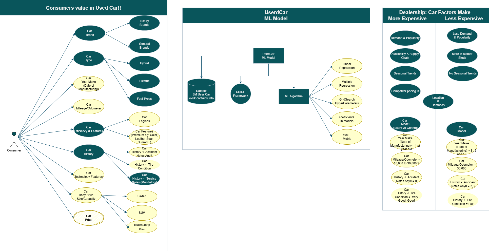

## Contents

### Exploratory Data Analysis (EDA)
- Check for zero Values in numerical features
- Check for zero values in categoraial features
- Check for Duplicate records
- Check for Unique Records
- Check for Outliers
- Check for Missing Values (NaN)

### Data Preparation , PCA for removing outliers , Data encoding
- Drop, Fill & Convert
- Log Transformation for outlier
- Applying PCA for removing outliers
- Distribution of 3 key features (Price, Year, Odometer)
- Odometer vs. Price by Year, (No Outliers)
- Data Preparation Summary 

### Modeling
- Simple Linear Regression model (Year vs Price)
- Calculate Linear Regression RMSE - Year
- Simple Linear Regression model (Odometer vs Price)
- Calculate RMSE of Linear Regression - Odometer
- Simple Linear Regression with PCA No Outliers Dataset
- Calculate RMSE of Linear Regression - Year with PCA no outliers data
- Multiple Linear Regression Model
- Calculate MSE of Multiple Linear Regression

### Evaluation

- Baseline Performance vs Model Performance
- Sequential Feature Selection (SFS)
- GridSearchCV Hyperparameter tuning for Ridge and Lasso
- Evaluate Ridge vs Lasso Regression
- Coefficients (Ridge vs Lasso)
- Ridge vs Lasso Regression

### Key Findings

#### Deployment
- Ridge Regression Actual vs Predicated Price
- Lasso Regression Actual vs Predicated Price
- Price Distribution by Year
- Calculate average (mean) price for each year - Actual and Predicted Prices
- Calculate average (mean) price for each range of odometer - Actual and Predicted Prices
- Price vs Odometer with Color-coded Condition

## Business Context 

### Exploratory Data Analysis (EDA)

### 1. Check for zero Values in numerical features

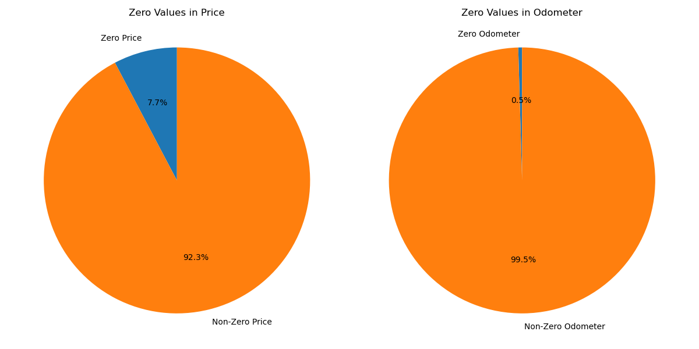

**Data Observation1**: Price has got around 32895 zero values of 6.6% of total data, Possible that these records dummy/unused and not interested for dealership, will drop $0 price records

**Data Observation2**: odometer has got around 1965 zero values of 0.5 % of total data 426879, though this smallest values of 0 will drop thise record.

### 2. Check for zero values in categoraial features

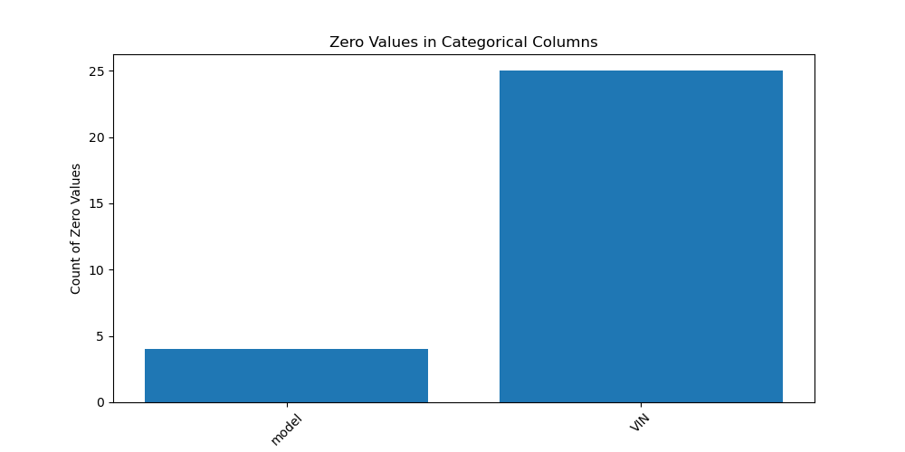

**Data Observation3**:looks there are few records in categorial field with VIN=0 and Model = 0 which records can be removed as with VIN and model number other data will be invalid also this percentage is less.

### 3. Check for Duplicate records

- Though the number of duplicate rows = 0 but duplicate VIN exists multiple times...

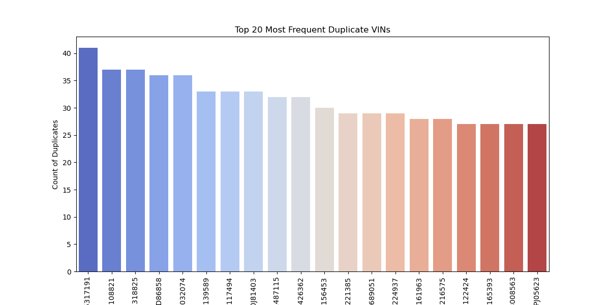

**Data Observation4**:
- Noticed that same VIN number is listed multiple times the regions are different may be valid due vechile move
- Few vin as got same odometer value, year.
- The dataset contains 40,280 unique VINs that have duplicate entries. 
- This means that these 40,280 vehicles have been listed multiple times, contributing to the 348,914 duplicate rows identified earlier
- But this depends on various other features like year, odometer, title_status, transmission, drive, fuel and model
so,
- Data entry errors
- Multiple listings of the same vehicle with updated details
- Incorrect merging of datasets so around approx 14K duplicate records exists multiple times.

### 4. Check for Unique Records
-  id value matches the total count of records, how ever the VIN value contains duplicates as seen above.

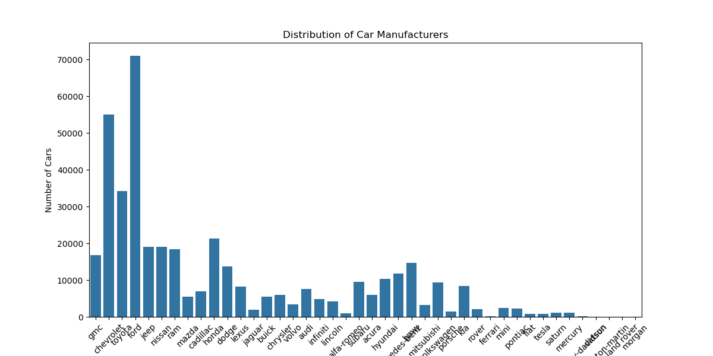

**Data Observation5**

**Top Manufacturers Dominate Listings**

- Certain manufacturers such as Ford, Chevrolet, Toyota, Honda, and Nissan have significantly higher listings indicating their widespread presence and popularity in the used car market.
- This aligns with real-world trends where these brands are among the highest-selling automotive manufacturers.

**American Brands Lead the Market**
- Ford and Chevrolet have the highest number of listings, showing strong demand for American-made vehicles.
- Brands like Dodge, GMC, and Jeep also have substantial representation, reflecting the popularity of trucks and SUVs.

**Japanese Brands are Strong Contenders**
- Toyota and Honda are among the most listed brands, reflecting their reputation for reliability, fuel efficiency, and resale value.
- Nissan, Subaru, and Mazda also have notable listings, reinforcing the popularity of Japanese cars in the used market.

**European Manufacturers Have Lower Representation**

- Brands like BMW, Mercedes-Benz, and Volkswagen have fewer listings compared to American and Japanese brands.
- This may be due to higher maintenance costs, lower resale demand, or fewer units in circulation.
Luxury and Specialty Brands Have Minimal Listings

- High-end manufacturers such as Tesla, Porsche, and Land Rover have relatively fewer listings.
- These brands cater to niche markets, and their high prices might limit their availability in the used car market.

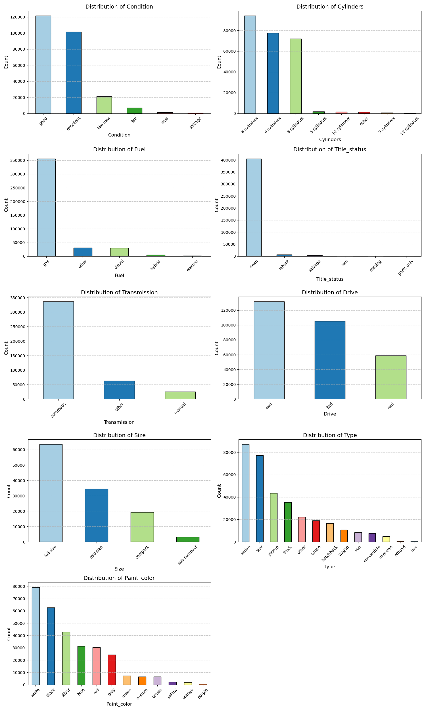

**Data Observation6**

**Condition Distribution**

- The majority of the vehicles in the dataset are categorized under a few specific conditions, with many missing or unknown values.
= "Like new" and "Excellent" conditions appear to be more frequent, while "Salvage" and "Fair" conditions are less common.

**Cylinders Distribution**

- 4-cylinder and 6-cylinder vehicles dominate the dataset, indicating a preference for fuel-efficient and mid-range performance vehicles.
- 8-cylinder engines, often found in trucks and sports cars, are also present but in smaller numbers.

**Fuel Type Distribution**

- Gasoline is the most common fuel type, suggesting that traditional fuel-powered vehicles still dominate the market.
- Diesel and hybrid vehicles have relatively lower counts, while electric vehicles make up a small fraction of the dataset.

**Title Status**

- The majority of the vehicles have a "Clean" title, meaning they have not been significantly damaged.
"Salvage" and "Rebuilt" titles are less frequent, indicating that heavily damaged or repaired vehicles are not as common in listings.

**Transmission Type**

- Automatic transmission is the most prevalent, showing a strong consumer preference for convenience over manual shifting.
- Manual transmission vehicles are significantly less common, often associated with sports cars or older models.

**Drive Type**

- Front-wheel drive (FWD) and four-wheel drive (4WD/AWD) vehicles appear to be the most common.
- Rear-wheel drive (RWD) vehicles are less frequent, likely due to their association with sports cars and specific performance vehicles.

**Size Distribution**

- The dataset has a significant number of "Full-size" and "Mid-size" vehicles.
- Compact cars and subcompacts have a lower frequency, possibly due to demand differences in different regions.

**Vehicle Type**

- Trucks, SUVs, and sedans dominate the listings, which aligns with market trends favoring utility and comfort.
Other types like convertibles and coupes have lower counts, likely reflecting niche market demand.

**Paint Color Distribution**

- The most common colors include black, white, silver, and gray, which are often considered standard and preferred for resale value.
- Uncommon colors like yellow, orange, and purple appear much less frequently, indicating a smaller market for such vehicles.

**Note** 
- The dataset reveals strong consumer preferences for gasoline-powered, automatic transmission vehicles with clean titles. The most frequent vehicle categories are trucks, SUVs, and sedans, aligning with real-world sales trends. 
- Fuel efficiency (4-cylinder engines), neutral paint colors, and mid-size to full-size cars dominate the listings, indicating market demand for practicality and affordability. There is a relatively low presence of electric, hybrid, and alternative-fuel vehicles, which might indicate slower adoption rates compared to gasoline-powered cars.

### 5. Check for Outliers

- From describe which fetchs only int & float numerical statstics , ID columns might be not intereseted or relevant to car dealership client, which can be drop off.

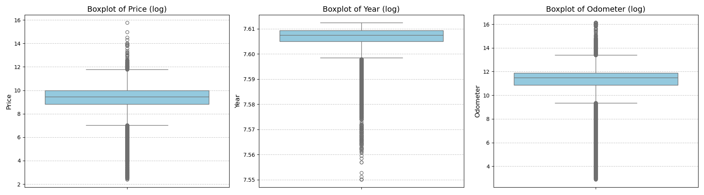

**Data Observation7**

**Price Outliers**

- The price distribution shows a significant number of extreme outliers.
- There are vehicles listed at extremely low prices (potentially unrealistic or promotional listings) and very high prices, possibly luxury or rare models.
- A reasonable price range should be determined to filter out erroneous data points.
- There are some listings where the price is recorded as zero.

- This could indicate:
- Missing data where sellers did not input the price.
- Incorrect or erroneous entries, which may need data cleaning

**Year Outliers**

- The year of manufacture appears to have some older vehicles that could be classified as vintage/classic cars.
- There may also be some outliers for future years, which could be incorrect or pre-orders rather than used listings.
- The bulk of the data is likely centered around more recent model years.

**Odometer Outliers**

- The odometer readings display a wide range, with some vehicles having extremely high mileage.
- Some extremely low-mileage cars could be newly listed or incorrect entries.
- High mileage vehicles may indicate well-used or older vehicles, whereas exceptionally low mileage could indicate showroom models or incorrect entries.

### 6. Check for Missing Values (NaN)

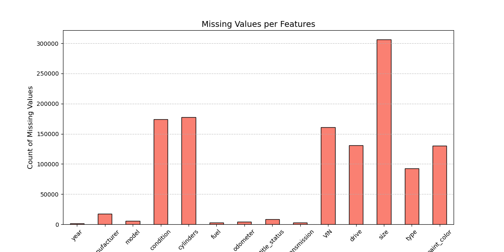

**Data Observation8**
- Size feature as got around 71% of data missing, may this feature can be dropped.
- VIN feautre got 37% missing may be it is valid to remove the complete row as without VIN details entered would be inaccurate
- Year missing data as low percentage from above graph can be removed for the same

### EDA Findings & Recomendation 

- Drop rows if missing values are low (e.g., missing year).
- Fill categorical values with mode (manufacturer, fuel, transmission).
- Fill missing numerical values with median (price, odometer).
- Drop columns with excessive missing data if they are not critical (size)

## Data Preparation

- Following below steps are executed for dataset preparation by apply drop method to relevant columns, elimanating zero values, fill categrial and drop null values.
- applied log transformation for outliers and applied pca from removing outliers
- visualized price, year and odometer distributions.
- Data enconding approach
### 1. Drop, Fill & Convert

**1 Drop row for duplicate VIN number based on price and odometer**
**2 Drop rows for VIN column = '0'**
**3 Drop Columns that are not required (id, VIN & region)**
**4. Drop Columns for size contains 71% of missing value**
**5. Drop zero values for Price & Odometer**
**6. Fill categorial Null values (NaN) to Not specified**
**7. Drop null values for numerical field**
**8. Convert DataTypes Float to Int and Object to String**

### 2. Log Transformation for outliers

**Year vs. Price**

- Older vehicles (lower years) generally have lower prices.
- Newer vehicles tend to have higher prices.
- Some outliers exist where older cars have high prices (potentially classic or luxury cars).

**Odometer vs. Price**

- Vehicles with higher odometer readings generally have lower prices.
- Some vehicles deviate from this trend, which could indicate luxury vehicles or misreported data.

**Year vs Odometer**
- The x-axis (Log Transformed Year) is tightly packed between 7.55 and 7.61, meaning the year range is very narrow.
- The y-axis (Log Transformed Odometer) has a wider spread, suggesting higher variance in odometer readings.

### 3. Applying PCA for removing outliers

**Year vs. Price**

- Price values are more spread out, with a wider range in log-transformed space..
- PCA-based outlier removal has likely eliminated more extreme cases, improving trend visibility.
- As Log Transformed Year decreases (older vehicles), the range of price values becomes wider, indicating greater variability in pricing for older models.

**Odometer vs. Price**

- Negative Correlation Between Odometer and Price: As the Log Transformed Odometer increases (higher mileage), the Log Transformed Price generally decreases, confirming the expected trend that vehicles with higher mileage tend to be priced lower..
**Outliers Detected on Both Ends**
- Low mileage, high price outliers (upper-left region) could be new or luxury cars.
- High mileage, low price outliers (lower-right region) likely represent older, heavily used vehicles.
- The PCA-based outlier removal helps to refine the dataset and exclude extreme anomalies.

**Year vs Odometer**
- Some outliers still persist at low odometer values for older years, which could indicate either rare well-preserved vehicles or potential data entry errors.

### 4. Distribution of 3 key features (Price, Year, Odometer)
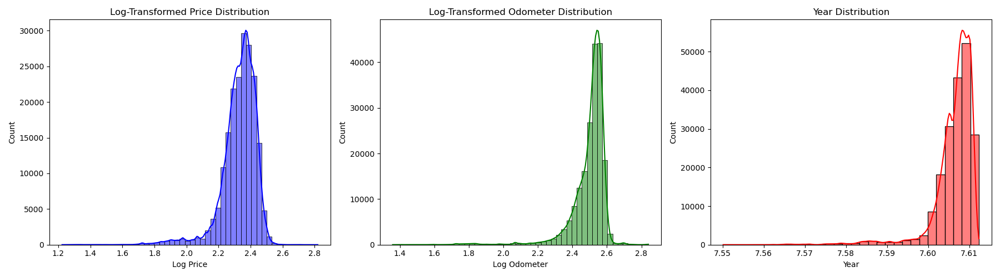
**Log-Transformed Price Distribution**
- Right-skewed (long tail): Some cars have very high prices, but they are relatively rare.
- Log transformation has helped normalize the distribution, reducing extreme price variations.
- Most vehicles are priced around a central value, but a few high-priced outliers still exist.

**Log-Transformed Odometer Distribution**
- Peak at log odometer ≈ 2.5–2.6, meaning most vehicles have similar mileage after log transformation.
- Narrow spread, showing less variance in odometer values compared to price.
- Small left tail suggests a few cars have very low mileage, possibly newer or well-maintained vehicles.

**Year Distribution**
**Highly skewed towards newer cars**
- The majority of listings are concentrated around the latest model years.
- Few cars exist in older year ranges (left side).
- This suggests that very new cars (likely recent releases) dominate the dataset.
- Most vehicles are relatively new, as older models are less frequently listed.
- The right skew indicates rapid depreciation, as fewer very old cars are available.

### 5. Odometer vs. Price by Year, (No Outliers)

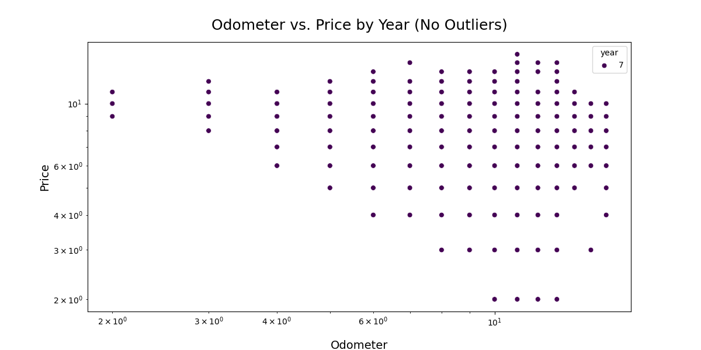
- Scatter plot visualizes the relationship between Odometer (Mileage) and Price, with data points grouped by Year, after outlier removal.

- Common odometer readings (e.g., 20,000, 30,000 miles) and price points (e.g., $5,000, $10,000) could be leading to this uniform spacing.
- Expected Negative Correlation Between Price and Odometer
- As odometer (mileage) increases, price decreases, confirming the standard vehicle depreciation trend.
- Vehicles with lower mileage tend to be priced higher.

### 6. Data Preparation Summary 

**Price Distribution (Price Boxplot)**

- There are many outliers in high-price values (luxury or premium cars).
- The median price is relatively low, suggesting most vehicles are affordable.
- Lower whiskers show some very cheap vehicles (possible salvage or damaged cars).

- Insights:

- Consider removing extreme high-price outliers to prevent misleading data.
- Investigate very low-priced listings for potential fraudulent or misclassified vehicles.

**Year Distribution (Year Boxplot)**

- The majority of vehicles are from the mid to late 2000s.
- Old cars (before 1990s) appear as outliers, possibly classic or vintage cars.
- Newer vehicles (past 2020) might have some anomalies due to incorrect data entries.

- Older cars (pre-1990) should be checked, as they might be incorrectly entered or special cases.

**Odometer Distribution (Odometer Boxplot)**

- The median odometer reading is moderate, but many high-mileage vehicles exist.
- High-mileage outliers (>300,000 miles) suggest either:

- Extreme odometer readings should be reviewed to detect possible incorrect entries.
- Very low-mileage listings should be verified as potential new vehicle misclassifications

### Modeling

### 1. Simple Linear Regression model (Year vs Price)

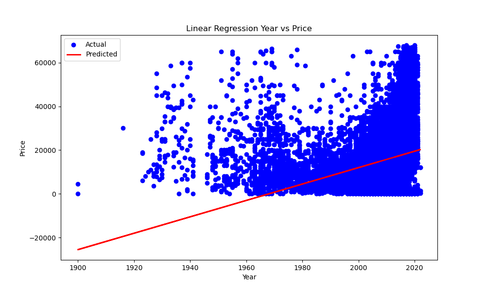
- Represents the real price distribution of cars from different years.
- There is a lot of spread, meaning price varies significantly even for the same year.

- The fitted linear regression line shows the model’s prediction of car prices based on the manufacturing year.
- Ideally, this line should follow the trend of the actual data, but here it doesn’t fit well.

**Issues in the Plot**
- Negative Predicted Prices for Older Cars
- The model extrapolates negative prices for cars before ~1950, which doesn’t make sense.
- This suggests that the linear relationship is too simple to model price accurately.

**High Variability in Actual Prices**

- The actual prices (blue dots) are widely scattered, meaning car prices depend on more than just the year.
- Many 2000+ model cars have vastly different prices, showing that features like brand, mileage, condition, etc., also play a role.

**Poor Fit (Underfitting Issue)**

- The regression line fails to capture the complexity of the data.
- This suggests that year alone is not enough to predict price accurately.

### 2. Calculate Linear Regression RMSE - Year
- RMSE = 11,785.82

- On average, the model's predictions deviate by around $11,785 from the actual car prices.
- A lower RMSE is better, meaning the model has smaller errors.

**RMSE is too high**

- If most used cars in the dataset are priced around $15,000 to $25,000, an RMSE of $11,785 is huge.
- This suggests that predictions are very inaccurate.

3. Simple Linear Regression model (Odometer vs Price)

- The plot shows a negative correlation (higher mileage cars tend to have lower prices).

- This is the best-fit line generated by linear regression.
- The downward slope confirms that higher mileage leads to lower price.

**Observations & Issues**

- The Relationship is Non-Linear
- The actual data is widely scattered and doesn't follow a perfect straight line.
- A curved trend might fit better, meaning a polynomial regression would be more appropriate.

**Price Variability is High**

- Many cars with the same odometer reading have vastly different prices.
- This suggests that other factors (e.g., year, brand, condition, fuel type) play a major role in price.

**Prediction Line is Too Simple**

- The red line underestimates high prices and overestimates low prices.
- The model assumes a strict linear relationship, which isn’t fully accurate.

### 4. Calculate RMSE of Linear Regression - Odometer
- Linear Regression RMSE - Odometer = 10802.244480599198

### 5. Simple Linear Regression with PCA No Outliers Dataset

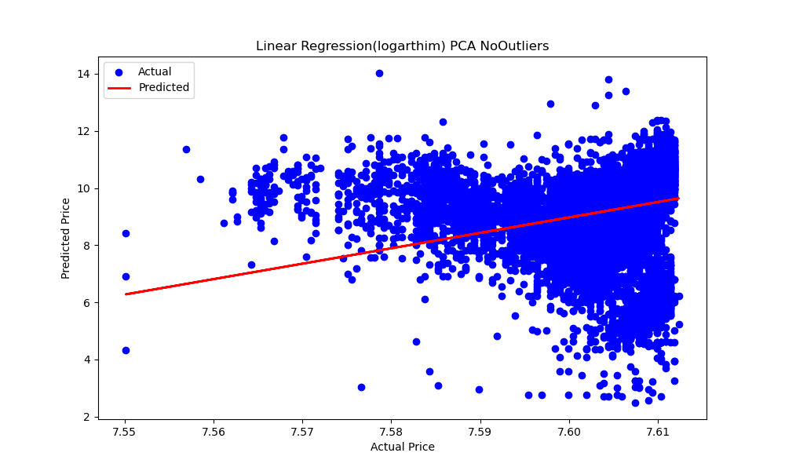
- The blue points are widely scattered, meaning the model isn't making precise predictions.
- There's high variance, suggesting that linear regression alone may not be capturing the full complexity of price trends.
- The red regression line is too shallow, indicating that the model struggles to learn the relationship between features and price.
- The low slope suggests that the model's predictions don't vary significantly, even when actual prices change.

**Logarithmic Transformation Helps Reduce Skewness**
- Using log-transformed prices helps make price distributions more normal, which is useful for regression models.
- However, a simple linear regression still struggles to capture the complexity of the data.

### 6. Calculate RMSE of Linear Regression - Year with PCA no outliers data
**RMSE = 1.0097**

- This value is low, but since logarithmic transformation (or PCA scaling) was likely applied, the RMSE is not in raw price values.
- If the target variable (price) was log-transformed, this RMSE is in log scale, meaning it represents an error of approximately 10.09% relative to the original scale.
- A low RMSE indicates better predictions compared to previous models with values around 10,000+.
- This suggests that PCA and outlier removal helped improve model performance.
- But, PCA May Have Removed Too Much Information

### 7. Multiple Linear Regression Model

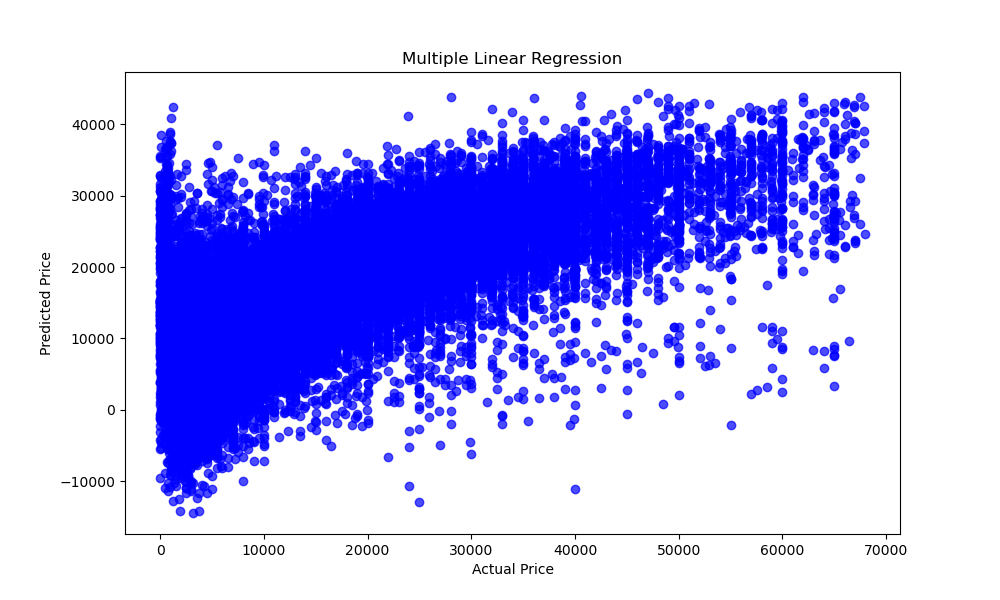
**High Variability in Predictions**

- The predicted prices don’t follow a tight diagonal trend.
- Many points deviate significantly, indicating high prediction errors.

**Negative Predictions Exist (Error in Model)**

- Some predicted values are negative, which is not realistic for car prices.
- The model needs regularization (Ridge/Lasso Regression).
- Some features might be poorly scaled or missing important interactions.

**Predictions Spread Widely at Higher Prices**
- At higher actual prices (~40,000+ USD), predictions vary significantly.
- This means the model is struggling to capture luxury/high-end car pricing factors.

8. Calculate MSE of Multiple Linear Regression

**RMSE = 8,752.86**

- On average, the model's predictions deviate by around $8,752 from actual prices.
- Lower RMSE is better, meaning the model has smaller errors.
- While better than simple linear regression (~11,785 RMSE), this is still high, indicating room for improvement.

## Evaluation

### 1. Baseline Performance vs Model(Multiple Linear Regression) Performance
- Baseline model performs poorly (RMSE 12306, R² = 0.00), meaning it has no predictive power.
- Multiple Linear Regression (RMSE = 8753, R² = 0.49) is significantly better but still has room for improvement.
- We have an R&sup2; score on the Test dataset of 0.49. This shows that about 49% of the variance is accounted for by the model.

### 2. Sequential Feature Selection (SFS)
- Sequential Feature Selection (SFS) to choose the 10 most important features from PCA-transformed data before training a Linear Regression model.
- Runs the sequential feature selection process:
- Evaluates each PCA feature's contribution to prediction.
- Iteratively selects the 10 best principal components.

### 3. GridSearchCV Hyperparameter tuning for Ridge and Lasso
- alpha is the regularization strength parameter:
- Low values (e.g., 0.01) → Less regularization (model behaves like standard Linear Regression).
- High values (e.g., 100.0) → More regularization (model shrinks coefficients more aggressively).
- Performs cross-validation (cv=5) → Splits data into 5 folds for validation.
- Ridge: Shrinks all coefficients but keeps all features.
- Lasso: Some coefficients become exactly zero, effectively performing feature selection.

### 4. Evaluate Ridge vs Lasso Regression
- Almost identical
- Ridge - Mean Absolute Error (MAE): 7314.280064407188
- Ridge - Mean Squared Error (MSE): 97397107.0094697
- Ridge - Root Mean Squared Error (RMSE): 9868.997264639893
- Ridge - R-squared (R2): 0.3649940734431999
- Lasso - Mean Absolute Error (MAE): 7314.300525221436
- Lasso - Mean Squared Error (MSE): 97397074.92183425
- Lasso - Root Mean Squared Error (RMSE): 9868.995638961153
- Lasso - R-squared (R2): 0.36499428264693623

*With R2 36% variance**

### 7. Coefficients (Ridge vs Lasso)

- **Year** Older cars reduce price by ~$2,418 per year.

- **Odometer** Higher mileage slightly increases price, which seems counterintuitive (possible data issue).

- **Cylinders** More cylinders increase price by ~$1,012 per unit

- **Manufacturer** Certain manufacturers increase price by ~$2,237

- **Condition**	-1963.86	Worse condition reduces price by ~$1,964.

- **Fuel Type** 	1641.76	Certain fuel types increase price by ~$1,642.

- **Title Status**	-2371.82	Non-clean titles reduce price by ~$2,372 (salvage, rebuilt, etc.).

- **Transmission**	-1465.11	Manual transmission reduces price by ~$1,465 (likely due to market preference).

- **Drive Type**	1410.98	AWD/4WD increases price by ~$1,411.

- **Vehicle Type**	-1494.11	Certain types reduce price by ~$1,494 (e.g., sedans vs. SUVs).

- Hence, (y_intercept) Ridge Regression model is 15,732.78. This value represents the predicted car price when all features are zero.

### 8.  Ridge vs Lasso Regression

- **Similar Performance:** Both Ridge and Lasso regression models have nearly identical Mean Absolute Error (MAE), Mean Squared Error (MSE), Root Mean Squared Error (RMSE), and R² scores, indicating they perform similarly.

- **Moderate Predictive Power:** The R² score of 0.36 suggests that only 36% of price variations are explained by the model, meaning significant room for improvement exists in predictive accuracy.

- **High Prediction Errors:** The MAE 7314 and RMSE 9869 indicate that the model’s predictions deviate from actual prices by several thousand dollars, which could lead to mispricing issues in sales.

## Key Findings

### Deployment

### 1. Ridge Regression Actual vs Predicated Price

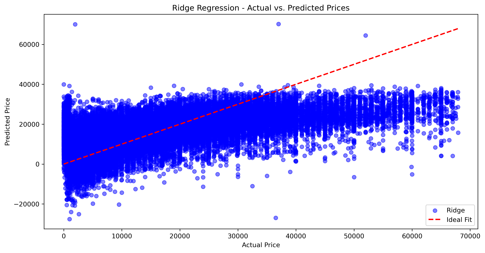

 - The spread of blue dots indicates high variance; some predictions are far below or above the ideal fit, showing potential underfitting.
 - Higher-priced cars tend to be underpredicted (points below the red line), suggesting that Ridge Regression struggles with expensive vehicles

### 2. Lasso Regression Actual vs Predicated Price

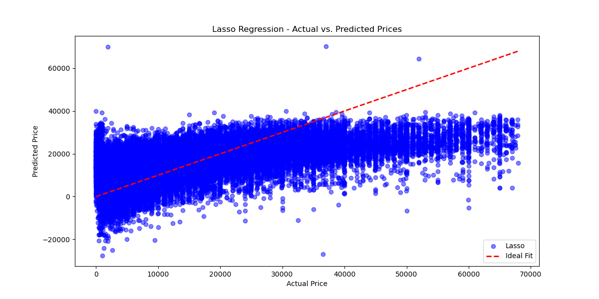

- Lasso Regression struggles with high variance in predictions.
- The model underpredicts expensive cars and overpredicts some cheap ones.

### 3. Price Distribution by Year

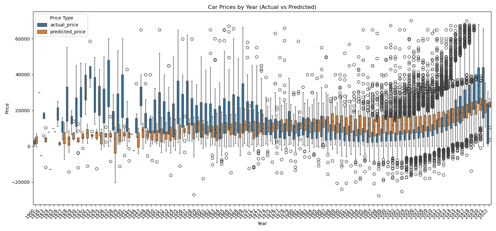

- The model consistently predicts lower car prices (orange) than actual prices (blue), particularly for older vehicles.
- The spread of actual prices for cars from pre-1980s is significantly wide, indicating some vintage cars hold extremely high value.
- Improved Prediction Accuracy for Newer Cars (Post-2000)
- Market Price Trends Captured Correctly (Post-2020)
- The general price increase in recent years (2020-2022) is captured, likely reflecting inflation, supply chain disruptions, and rising demand for used cars.

### 4. Calculate average (mean) price for each year - Actual and Predicted Prices

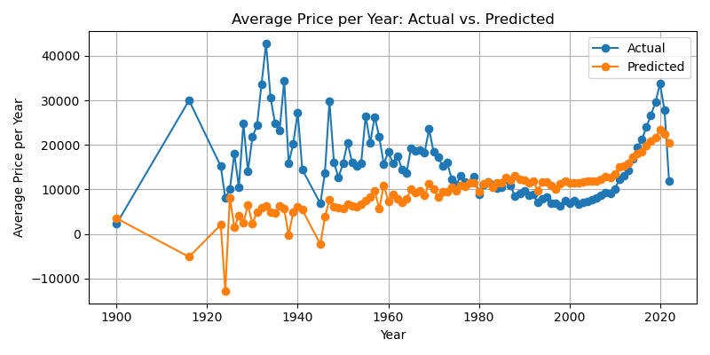

- The actual prices show significant fluctuations, especially in older cars (before 1960), indicating high variability in classic or vintage car prices.
- Some peaks (e.g., around 1920 and 1940) could be due to rare collector vehicles being priced significantly higher than average cars.
- The predicted prices do not follow extreme fluctuations in older years and remain more stable than actual prices.
- After 1980, the predicted and actual prices become more aligned, suggesting the model is better at estimating prices for modern vehicles.
- The price trend gradually increases for recent years, capturing inflation, market demand, and newer car depreciation trends more effectively.
- The model captures the recent price surge (post-2020) fairly well, likely reflecting supply chain issues, inflation, and increased demand for newer cars.
- However, the actual prices still show higher peaks compared to the predicted ones, meaning luxury or high-demand models might be underpriced by the model.

### 5. Calculate average (mean) price for each range of odometer - Actual and Predicted Prices

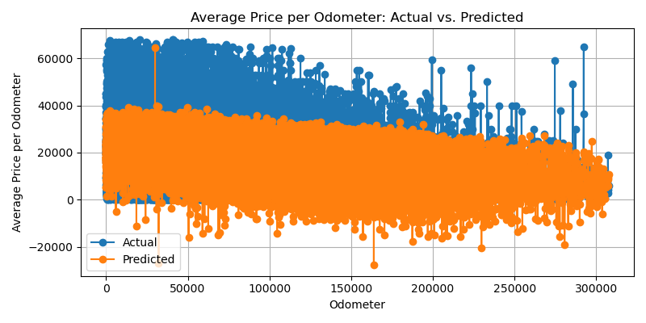

**Negative Correlation Between Odometer and Price**

- As mileage (odometer) increases, the actual car price (blue) decreases, showing the expected negative correlation between vehicle usage and value.
- Predicted prices (orange) also follow this trend but are more compressed.
- The model predict high-priced cars accurately (above ~$40,000), as predicted prices do not capture the full range of actual prices.

### 6. Price vs Odometer with Color-coded Condition

- As odometer readings increase, actual car prices decrease significantly, which aligns with standard vehicle depreciation trends.
- High-mileage cars tend to be valued lower due to wear and tear, potential maintenance costs, and reduced reliability.
- Vehicles with over 150,000 miles seem to have a price floor, meaning their depreciation slows down after a certain point.

**Impact of Vehicle Condition on Pricing**
- Higher-condition vehicles (yellow dots) are priced higher compared to lower-condition vehicles (dark purple dots).
- This suggests that well-maintained cars retain more value, even with higher mileage, making condition a critical pricing factor.

**Outliers Indicating Special Cases**

- Some high-priced outliers with high mileage may be luxury cars, collector vehicles, or models with significant aftermarket modifications.

