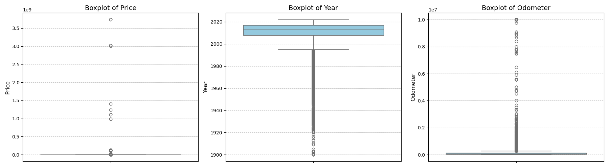

# Berkeley
Berkeley ML/AI Modules and Practical application II: Used Car Dealership

## Practical Application2 UsedCarDealership <What makes Car More or Less Expensive>

## [Juypter Notebook](https://github.com/Jhonson924/berkeley/blob/main/Used_Car_Dealership/usedCarDealership.ipynb)

### Context
- Key Factors influences dealership which make Car More or Less expensive eg: Market Demand
- Consumer values in used Cars.

### Business Problem Statement

#### Consumer Vaules in Used Cars 
- Car Brand (Luxury vs General)
- Car Type (Hybrid, Electric, Fuel)
- Car Year Make, Odometer
- Car Efficiency & Features (Engines, Premium (Leather Seat, Sunroof, colors))
- Car History (No acciedent report, service , tire)
- Car Technology Features (info and entertianment)
- Car Body/Style/Capacity (SUV, Sedan, Trucks, 5 seater, 7 Seater..)
- Car Price

#### What makes Car More or Less Expensive
- Market Factors
-- Demand & Popularity
-- Availability & Supply Chain
-- Seasonal Trends
-- Competitor pricing
- Consumer Values understanding
-- Car Brand , Type , Year & Mileage
-- Car History
-- Car Body/Style/Capacity
-- Car Price

### Project Goal
- What Drives the Price of Car

### Logical Data

## Contents

### Exploratory Data Analysis (EDA)
- Check for zero Values in numerical features
- Check for zero values in categoraial features
- Check for Duplicate records
- Check for Unique Records
- Check for Outliers
- Check for Missing Values (NaN)

### Data Preparation , PCA for removing outliers , Data encoding
- Drop row for duplicate VIN number based on price and odometer
- Drop rows for VIN column = '0'
- Drop Columns that are not required (id, VIN & region)
- Drop Columns for size contains 71% of missing value
- Drop zero values for Price & Odometer
- Fill categorial Null values (NaN) to Not specified
- Drop null values for numerical field
- Convert DataTypes Object to String
- Log Transformation for outliers
- Applying PCA for removing outliers
- Data Encoding
- Ordinal encoding
- One hot encoding for fuel

## Business Context 

### Exploratory Data Analysis (EDA)

### 1. Check for zero Values in numerical features

**Data Observation1**: Price has got around 32895 zero values of 6.6% of total data, Possible that these records dummy/unused and not interested for dealership, will drop $0 price records

**Data Observation2**: odometer has got around 1965 zero values of 0.5 % of total data 426879, though this smallest values of 0 will drop thise record.

### 2. Check for zero values in categoraial features

**Data Observation3**:looks there are few records in categorial field with VIN=0 and Model = 0 which records can be removed as with VIN and model number other data will be invalid also this percentage is less.

### 3. Check for Duplicate records

- Though the number of duplicate rows = 0 but duplicate VIN exists multiple times...

**Data Observation4**:
- Noticed that same VIN number is listed multiple times the regions are different may be valid due vechile move
- Few vin as got same odometer value, year.
- The dataset contains 40,280 unique VINs that have duplicate entries. 
- This means that these 40,280 vehicles have been listed multiple times, contributing to the 348,914 duplicate rows identified earlier
- But this depends on various other features like year, odometer, title_status, transmission, drive, fuel and model
so,
- Data entry errors
- Multiple listings of the same vehicle with updated details
- Incorrect merging of datasets so around approx 14K duplicate records exists multiple times.

### 4. Check for Unique Records
-  id value matches the total count of records, how ever the VIN value contains duplicates as seen above.

**Data Observation5**

**Top Manufacturers Dominate Listings**

- Certain manufacturers such as Ford, Chevrolet, Toyota, Honda, and Nissan have significantly higher listings indicating their widespread presence and popularity in the used car market.
- This aligns with real-world trends where these brands are among the highest-selling automotive manufacturers.

**American Brands Lead the Market**
- Ford and Chevrolet have the highest number of listings, showing strong demand for American-made vehicles.
- Brands like Dodge, GMC, and Jeep also have substantial representation, reflecting the popularity of trucks and SUVs.

**Japanese Brands are Strong Contenders**
- Toyota and Honda are among the most listed brands, reflecting their reputation for reliability, fuel efficiency, and resale value.
- Nissan, Subaru, and Mazda also have notable listings, reinforcing the popularity of Japanese cars in the used market.

**European Manufacturers Have Lower Representation**

- Brands like BMW, Mercedes-Benz, and Volkswagen have fewer listings compared to American and Japanese brands.
- This may be due to higher maintenance costs, lower resale demand, or fewer units in circulation.
Luxury and Specialty Brands Have Minimal Listings

- High-end manufacturers such as Tesla, Porsche, and Land Rover have relatively fewer listings.
- These brands cater to niche markets, and their high prices might limit their availability in the used car market.

**Data Observation6**

**Condition Distribution**

- The majority of the vehicles in the dataset are categorized under a few specific conditions, with many missing or unknown values.
= "Like new" and "Excellent" conditions appear to be more frequent, while "Salvage" and "Fair" conditions are less common.

**Cylinders Distribution**

- 4-cylinder and 6-cylinder vehicles dominate the dataset, indicating a preference for fuel-efficient and mid-range performance vehicles.
- 8-cylinder engines, often found in trucks and sports cars, are also present but in smaller numbers.

**Fuel Type Distribution**

- Gasoline is the most common fuel type, suggesting that traditional fuel-powered vehicles still dominate the market.
- Diesel and hybrid vehicles have relatively lower counts, while electric vehicles make up a small fraction of the dataset.

**Title Status**

- The majority of the vehicles have a "Clean" title, meaning they have not been significantly damaged.
"Salvage" and "Rebuilt" titles are less frequent, indicating that heavily damaged or repaired vehicles are not as common in listings.

**Transmission Type**

- Automatic transmission is the most prevalent, showing a strong consumer preference for convenience over manual shifting.
- Manual transmission vehicles are significantly less common, often associated with sports cars or older models.

**Drive Type**

- Front-wheel drive (FWD) and four-wheel drive (4WD/AWD) vehicles appear to be the most common.
- Rear-wheel drive (RWD) vehicles are less frequent, likely due to their association with sports cars and specific performance vehicles.

**Size Distribution**

- The dataset has a significant number of "Full-size" and "Mid-size" vehicles.
- Compact cars and subcompacts have a lower frequency, possibly due to demand differences in different regions.

**Vehicle Type**

- Trucks, SUVs, and sedans dominate the listings, which aligns with market trends favoring utility and comfort.
Other types like convertibles and coupes have lower counts, likely reflecting niche market demand.

**Paint Color Distribution**

- The most common colors include black, white, silver, and gray, which are often considered standard and preferred for resale value.
- Uncommon colors like yellow, orange, and purple appear much less frequently, indicating a smaller market for such vehicles.

**Note** 
- The dataset reveals strong consumer preferences for gasoline-powered, automatic transmission vehicles with clean titles. The most frequent vehicle categories are trucks, SUVs, and sedans, aligning with real-world sales trends. 
- Fuel efficiency (4-cylinder engines), neutral paint colors, and mid-size to full-size cars dominate the listings, indicating market demand for practicality and affordability. There is a relatively low presence of electric, hybrid, and alternative-fuel vehicles, which might indicate slower adoption rates compared to gasoline-powered cars.

### 5. Check for Outliers

- From describe which fetchs only int & float numerical statstics , ID columns might be not intereseted or relevant to car dealership client, which can be drop off.

**Data Observation7**

**Price Outliers**

- The price distribution shows a significant number of extreme outliers.
- There are vehicles listed at extremely low prices (potentially unrealistic or promotional listings) and very high prices, possibly luxury or rare models.
- A reasonable price range should be determined to filter out erroneous data points.
- There are some listings where the price is recorded as zero.

- This could indicate:
- Missing data where sellers did not input the price.
- Incorrect or erroneous entries, which may need data cleaning

**Year Outliers**

- The year of manufacture appears to have some older vehicles that could be classified as vintage/classic cars.
- There may also be some outliers for future years, which could be incorrect or pre-orders rather than used listings.
- The bulk of the data is likely centered around more recent model years.

**Odometer Outliers**

- The odometer readings display a wide range, with some vehicles having extremely high mileage.
- Some extremely low-mileage cars could be newly listed or incorrect entries.
- High mileage vehicles may indicate well-used or older vehicles, whereas exceptionally low mileage could indicate showroom models or incorrect entries.

### 6. Check for Missing Values (NaN)

**Data Observation8**
- Size feature as got around 71% of data missing, may this feature can be dropped.
- VIN feautre got 37% missing may be it is valid to remove the complete row as without VIN details entered would be inaccurate
- Year missing data as low percentage from above graph can be removed for the same

### EDA Findings & Recomendation 

- Drop rows if missing values are low (e.g., missing year).
- Fill categorical values with mode (manufacturer, fuel, transmission).
- Fill missing numerical values with median (price, odometer).
- Drop columns with excessive missing data if they are not critical (size)

## Data Preparation

- Following below steps are executed for dataset preparation by apply drop method to relevant columns, elimanating zero values, fill categrial and drop null values.
- applied log transformation for outliers and applied pca from removing outliers
- visualized price, year and odometer distributions.
- Data enconding approach

### 1. Drop row for duplicate VIN number based on price and odometer
### 2. Drop rows for VIN column = '0'
### 3. Drop Columns that are not required (id, VIN & region)
### 4. Drop Columns for size contains 71% of missing value
### 5. Drop zero values for Price & Odometer
### 6. Fill categorial Null values (NaN) to Not specified
### 7. Drop null values for numerical field
### 8. Convert DataTypes Float to Int and Object to String
### 9. Log Transformation for outliers

**Year vs. Price**

- Older vehicles (lower years) generally have lower prices.
- Newer vehicles tend to have higher prices.
- Some outliers exist where older cars have high prices (potentially classic or luxury cars).

**Odometer vs. Price**

- Vehicles with higher odometer readings generally have lower prices.
- Some vehicles deviate from this trend, which could indicate luxury vehicles or misreported data.

**Year vs Odometer**
- The x-axis (Log Transformed Year) is tightly packed between 7.55 and 7.61, meaning the year range is very narrow.
- The y-axis (Log Transformed Odometer) has a wider spread, suggesting higher variance in odometer readings.

### 10. Applying PCA for removing outliers

**Year vs. Price**

- Price values are more spread out, with a wider range in log-transformed space..
- PCA-based outlier removal has likely eliminated more extreme cases, improving trend visibility.
- As Log Transformed Year decreases (older vehicles), the range of price values becomes wider, indicating greater variability in pricing for older models.

**Odometer vs. Price**

- Negative Correlation Between Odometer and Price: As the Log Transformed Odometer increases (higher mileage), the Log Transformed Price generally decreases, confirming the expected trend that vehicles with higher mileage tend to be priced lower..
**Outliers Detected on Both Ends**
- Low mileage, high price outliers (upper-left region) could be new or luxury cars.
- High mileage, low price outliers (lower-right region) likely represent older, heavily used vehicles.
- The PCA-based outlier removal helps to refine the dataset and exclude extreme anomalies.

**Year vs Odometer**
- Some outliers still persist at low odometer values for older years, which could indicate either rare well-preserved vehicles or potential data entry errors.

### Distribution of 3 key features (Price, Year, Odometer)

**Log-Transformed Price Distribution**
- Right-skewed (long tail): Some cars have very high prices, but they are relatively rare.
- Log transformation has helped normalize the distribution, reducing extreme price variations.
- Most vehicles are priced around a central value, but a few high-priced outliers still exist.

**Log-Transformed Odometer Distribution**
- Peak at log odometer ≈ 2.5–2.6, meaning most vehicles have similar mileage after log transformation.
- Narrow spread, showing less variance in odometer values compared to price.
- Small left tail suggests a few cars have very low mileage, possibly newer or well-maintained vehicles.

**Year Distribution**
**Highly skewed towards newer cars**
- The majority of listings are concentrated around the latest model years.
- Few cars exist in older year ranges (left side).
- This suggests that very new cars (likely recent releases) dominate the dataset.
- Most vehicles are relatively new, as older models are less frequently listed.
- The right skew indicates rapid depreciation, as fewer very old cars are available.

### Odometer vs. Price by Year, (No Outliers)

- Scatter plot visualizes the relationship between Odometer (Mileage) and Price, with data points grouped by Year, after outlier removal.

- Common odometer readings (e.g., 20,000, 30,000 miles) and price points (e.g., $5,000, $10,000) could be leading to this uniform spacing.
- Expected Negative Correlation Between Price and Odometer
- As odometer (mileage) increases, price decreases, confirming the standard vehicle depreciation trend.
- Vehicles with lower mileage tend to be priced higher.

### 11. Data Encoding
### 12. Ordinal encoding
### 13. One hot encoding for fuel

### Key Findings

