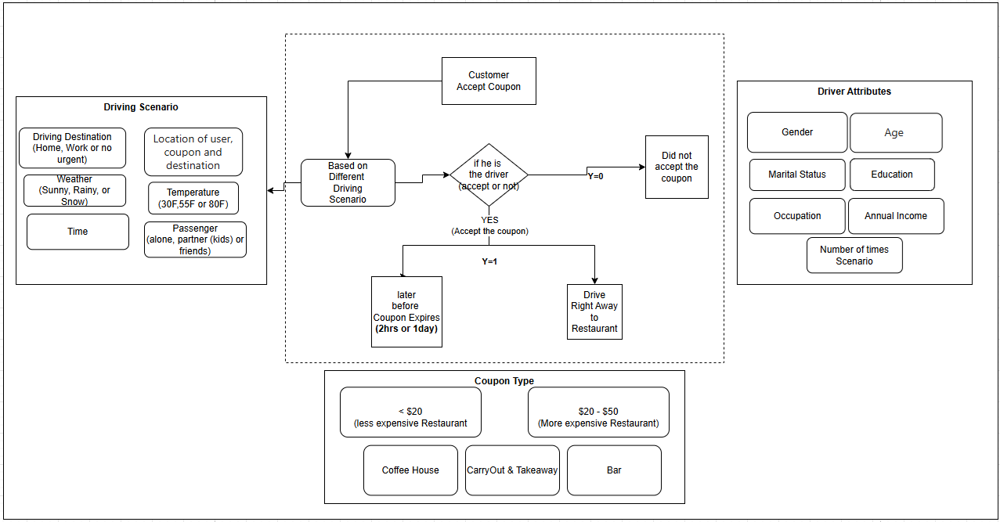
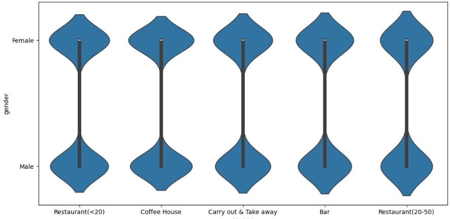
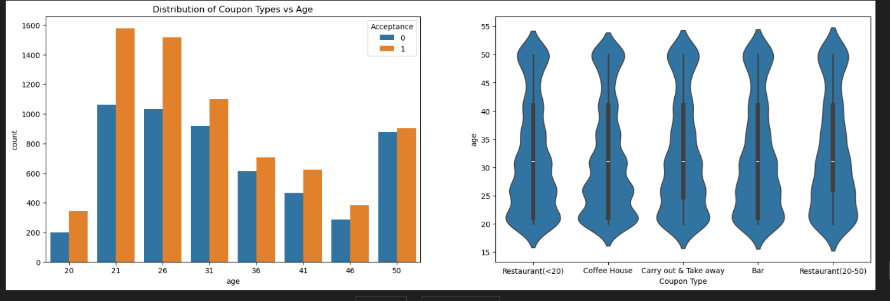
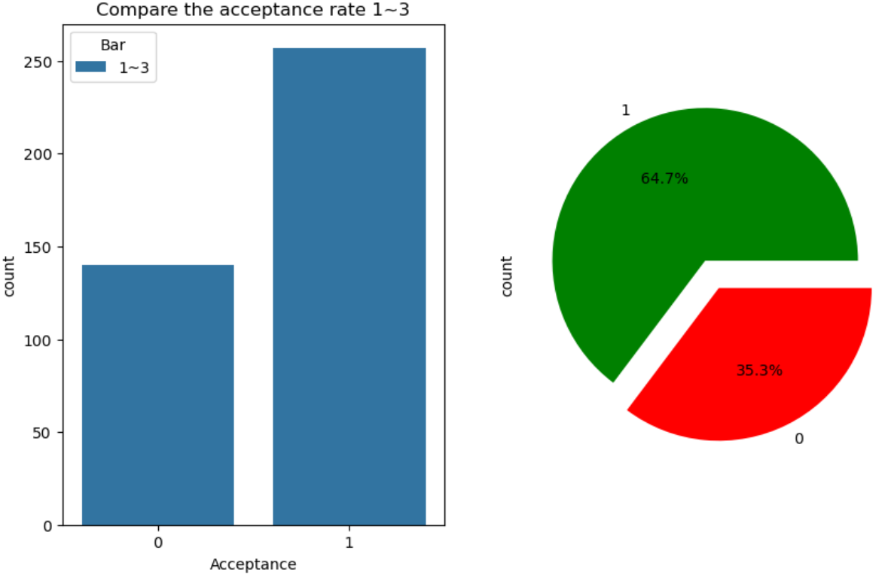
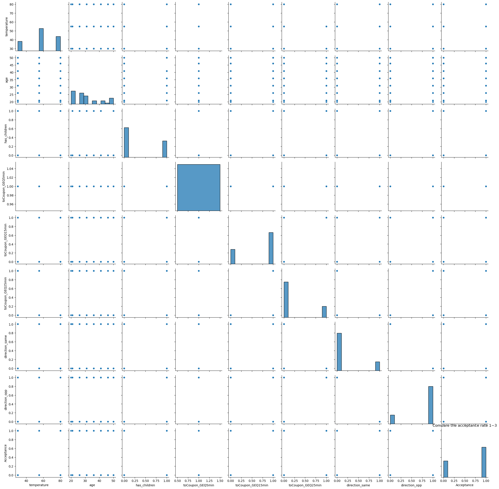

# Berkeley
Berkeley ML/AI Modules and Practical application

## Practical Application1 <Will the Customer Accept the Coupon>

## [Juypter Notebook](https://github.com/Jhonson924/berkeley/blob/main/practical%20application1/coupons.ipynb)

### Context
A coupon is delivered to driver cell phone for a restaurant near where you are driving.

### Business Problem Statement

#### Consumer <Coupon>
- Would driver accept that coupon and take a short detour to the restaurant? 
- Would driver accept the coupon but use it on a subsequent trip? 
- Would driver ignore the coupon entirely? 
- What if the coupon was for a bar instead of a restaurant? What about a coffee house? 
- Would driver accept a bar coupon with a minor passenger in the car? 
- What about if it was just dirver and driver partner in the car? 
- Would weather impact the rate of acceptance? What about the time of day?

#### Business
- Whether the coupon is delivered to the driver or not, 
- What are the factors that determine whether a driver accepts the coupon once it is delivered to them? 
- How would business determine whether a driver is likely to accept a coupon

### Project Goal
- visualizations and probability distributions to distinguish between customers who accepted a driving coupon versus those that did not.

### Logical Data

### Key Findings

#### 1. Gender vs CouponType

- Consistency Across Genders: For each activity, the distributions for Male and Female appear very similar in shape and spread.
- Uniformity in Distribution: The density for activities like "Bar" and "Coffee House" appears fairly uniform between genders, suggesting a similar engagement rate.
- Activity Engagement: The width of the violin plots indicates where most individuals fall in the distribution for a specific activity (e.g., people are more uniformly distributed in "Carry out & Take away").

#### 2. ageAcceptanceRate

 - Younger individuals, especially those in their 20s and early 30s, show higher coupon acceptance (orange bars dominate in those age groups). Older age groups, while having fewer drivers, seem less likely to accept coupons.
- Across most coupon types, the central tendency (median line) lies in the younger age groups (e.g., mid-20s to early 30s).
- Bar coupons show a slightly broader distribution, indicating some older individuals accept bar coupons compared to other types.
##### Summary
- Younger individuals (20-30 years old) are more likely to accept coupons, regardless of type.
- Coupon type matters: Bar and restaurant coupons seem to appeal to a broader age range compared to others like coffee houses or carry-out.

#### 3. passangerAcceptanceRate

- Drivers alone are the largest group and show a higher likelihood of accepting coupons (orange bar is taller than the blue bar for "Alone").
- Drivers with friends are also more likely to accept coupons, though the gap between acceptance (orange) and non-acceptance (blue) is smaller than for those alone.
- Drivers with kids or partners have fewer drivers, and the acceptance rates are nearly balanced or slightly lower than non-acceptance.

- Across most coupon types, drivers who are alone dominate the density of acceptance, indicating they are more likely to use coupons regardless of type.
- Drivers with friends also show moderate densities, particularly for Bar and Coffee House coupons.
- Drivers with kids or partners have lower densities overall, indicating less engagement with coupons.

##### Summary
- Being alone significantly increases coupon acceptance rates across all types.
- Friends as passengers also positively influence acceptance but not as strongly as being alone.
- Kids and partners are associated with lower coupon acceptance rates, likely due to different priorities or constraints during travel.

#### 4. BarCoupoun Analysis (1~3 times visited)

-The majority (64.7%) of drivers in the group(BAR) accepted the coupon, highlighting a clear preference or tendency to accept bar coupons.

#### 4.1 onlyBarCoupon Analysis (1~3 times visited)

1. Diagonal (Histograms):

- The diagonal of the pairplot contains histograms for each variable, showing its distribution.
- Variables like age or temperature may show the spread of values across the dataset.
- Variables has_children, accept_coupon appear as bar plots since they represent discrete values.

2. Scatterplots:

- The Scatterplots plots compare two variables, with each subplot showing the relationship between one pair.
- Temperature vs. Age: Scatterplot showing how these two variables relate.
- Acceptance Decision vs. to_coupon distance: Shows how coupon acceptance changes with distance.Clusters near shorter distances may suggest higher acceptance.
- Direction_Same vs. Acceptance: If traveling in the same direction as the coupon's location (direction_same), drivers are more likely to accept the coupon.

#### Summary
- Younger drivers are more likely to accept coupons, particularly bar coupons, as evidenced by the clusters around specific age groups.
- When the direction of travel aligns with the coupon's location, acceptance increases.

#### 5. Next Steps
- Additional Correlation Analysis, deep dive into continuous variables, discrete , normal distribution and more.
- Dive deeper into specific relationships, such as the impact of age, and travel direction on coupon acceptance.